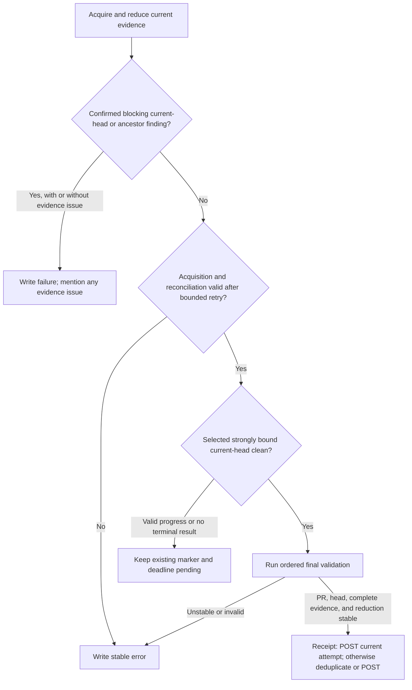
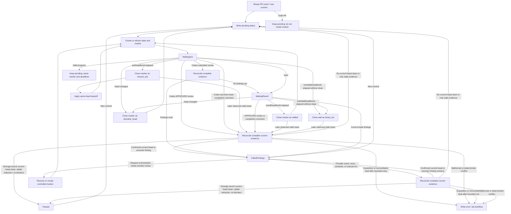

# Codex Review Gate Advanced Design

Languages: [British English (en-GB)](DESIGN.md) | [简体中文 (zh-CN)](DESIGN.zh-CN.md)

## Goal

`codex/review-gate` turns Codex review evidence into a deterministic commit
status that can be required by branch protection. The gate passes only from a
complete, stable evidence reduction when the selected official trusted clean
artifact matches the closed grammar, binds strongly to the current PR head,
and no current-head or ancestor Codex finding remains blocking. Pass means only
that this required commit status is `success`; it never attests a named triple
review or overall merge readiness. Controlled
`@codex review` requests help obtain that evidence; they are not evidence
authority.

## Evidence Reconciliation

Every run reconstructs the required GitHub evidence instead of treating the
sticky state comment or commit-status history as the decision source.
The machine-readable authority for the closed reducer policy is
[`decision-table.json`](decision-table.json), currently
`policy_version: 1.4.0`.

The result precedence is:

1. Classify every commit-bound finding against the current head. Current-head
   and proven-ancestor findings remain in the reduction. A proved
   non-ancestor finding is retained for audit, removed from the blocking set,
   and the evidence is reduced again. An unknown relationship receives bounded
   retry and then becomes the stable evidence error `ancestry-unverified`.
2. If a confirmed current-head or ancestor finding remains blocking, write
   `failure`. An exact joined thread remains blocking until its authoritative
   `isResolved` value is exactly `true`; `isOutdated` and a later clean result
   cannot close it. If another evidence error is present, keep `failure` and
   mention the evidence issue in the failure summary.
3. With no confirmed blocking finding, transient acquisition or reconciliation
   faults receive bounded retries and then write stable `error`. Deterministic
   malformed, provider-identity, schema, commit-binding, and ancestry errors
   also write `error`.
4. If the complete reduction is stable, the selected official trusted clean
   artifact matches the closed grammar and binds strongly to the current head,
   and no finding blocks, write `success`.
5. If valid progress is present, or no acceptable terminal artifact is yet
   available, keep `pending` under the existing marker and deadline.

Persisted `pending` or `error` statuses and closed marker-wait outcomes from
older runs are audit history only. A transient incomplete API or pagination
attempt stops blocking only when a successful bounded retry or later run
reconstructs a complete current snapshot; bounded retry exhaustion writes
stable `error`. Every malformed or unrecognised provider artifact,
identity failure, schema failure, or commit-parse/binding failure still present
in that complete snapshot is a global evidence error; a newer clean artifact
does not supersede it.

Evidence reconciliation precedes wait-deadline orchestration. Marker deadlines
end or retry waits when no acceptable terminal result is available; they do
not create an acceptance window for provider artifacts. A valid current-head
clean artifact created after `maxWaitDeadlineAt` can pass on a later complete
run.

Issue-comment terminal-heading detection strips complete leading emoji
graphemes after an optional Markdown heading marker before looking for
`Codex Review`. This includes modifier, regional-indicator and tag flags,
keycaps, variation selectors, and ZWJ sequences. The parser has fixed
code-unit and grapheme budgets; an emoji-shaped heading that exhausts either
budget is terminal-looking malformed evidence rather than being ignored.
An unknown single decorator token immediately before `Codex Review` is also
terminal-looking malformed evidence; it does not broaden the accepted clean
or finding grammars.
Progress is valid only when the complete normalised body matches the supported
single-line progress grammar. It produces a pending evidence result under the
existing marker and deadline; it does not acknowledge the marker, reset or
extend a deadline, or cause a replacement marker to be posted. A
terminal-looking body outside that exact grammar is deterministically
malformed and writes `error` when no confirmed finding controls the result.

Unthreaded top-level issue-comment findings have no GitHub resolution flag. An
older same-head or proven-ancestor finding remains active unless the selected
valid official trusted clean artifact is bound to the current head and is
strictly later than that finding. A proved non-ancestor finding is audit-only;
it is removed before re-reduction. Issue-comment `created_at` and `updated_at`
must both be canonical, with `updated_at >= created_at`; `updated_at` is the
artifact revision time. REST issue-comment timestamps have one-second
granularity, so two issue-comment artifacts in the same revision second are
always ambiguous: even `created_at == updated_at` cannot prove that no
same-second edit occurred, and numeric IDs never break that tie. Pull-request
reviews at the same validated `submitted_at` may use the larger canonical ID
only within the review channel; equal-time cross-channel evidence is ambiguous.

A clean result bound to a commit that is strictly proven to be an ancestor of
the current head is stale audit evidence, not malformed evidence. It leaves the
current head pending and is included in the baseline of any newly created
marker. A clean bound to a commit proved to be a non-ancestor, including a
valid `behind` or `diverged` comparison, is audit-only and is removed before
the evidence is reduced again. Only a relationship that remains unknown after
bounded retries becomes stable `error` with `ancestry-unverified`. A delayed
stale issue-comment clean also cannot wake an existing current-head marker: a
completion transition must match the exact provider artifact selected as the
current-head clean result.

Ancestry uses the REST commit-comparison endpoint with exact 40-hex
`base...head` request endpoints. The response must contain documented
`base_commit`, `merge_base_commit`, `status`, `ahead_by`, `behind_by`,
`total_commits`, and `commits` fields. Counts must be nonnegative safe
integers, `total_commits` must equal `ahead_by`, and the closed relationship
must agree with its counts and merge base. The unpaginated commit list must
contain `min(ahead_by, 250)` unique full-SHA entries, exclude the base and
merge-base commits, and bind a nonempty list's documented final entry to the
requested head SHA. `ahead` proves ancestry,
`identical` proves equality, while valid `behind` and `diverged` responses
prove non-ancestry. Contradictions fail closed as deterministic invalid
responses. A non-linear comparison with both counts positive is `diverged`
regardless of which count is larger; count magnitude never reclassifies it as
`ahead` or `behind`. The action neither depends on the undocumented `head_commit` field
nor performs a separate head-commit GET. A relationship that remains unknown
after bounded retries produces stable `error` with reason
`ancestry-unverified`; it is never guessed.

Before writing `success`, the action follows one fixed order:

1. Read and cache the newest same-context live gate status on a best-effort
   basis, preserving its producer identity.
2. Re-read PR lifecycle and the exact head.
3. Re-read the final fully paginated evidence snapshot. If its GraphQL thread
   comments and REST review comments expose a possible cross-channel orphan,
   including an inline comment whose parent review is not yet visible, perform
   one bounded whole-snapshot reload; a persistent orphan becomes an evidence
   error after bounded reconciliation.
4. Revalidate and reduce findings, provider identity, the closed
   terminal-result grammar, and commit binding. The re-read PR lifecycle, head,
   complete evidence, blocking set, and selected result must remain stable
   against the prior complete reduction; otherwise the action refuses success.
   The reduction certificate binds each selected or applicable issue-comment
   carrier's `created_at`, `updated_at`, and carrier digest, so an edit cannot
   pass final validation as unchanged evidence.
5. Without another network read, POST `success` from the current run attempt
   whenever receipt mode is enabled, even when the cached status already
   matches. Outside receipt mode, skip only when that newest same-context
   status is already `success` and its producer is exact
   `github-actions[bot]` / `Bot`; otherwise issue the single non-retried POST.

If the initial status read fails, the action still posts the freshly computed
status after the final snapshot. Missing marker, baseline, deadline, recovery,
or status-history lineage cannot demote an otherwise valid latest current-head
clean provider artifact.

The optional commit-status deduplication GET has its own best-effort budget,
separate from review evidence: 100 statuses per page, at most 10 pages or 1,000
items, 1 MiB per response, 4 MiB in total, and 16 actual fetch attempts. An
API, payload, pagination, or budget failure sets `readFailed`; it does not make
the review evidence incomplete or change its result. Receipt mode always POSTs
the current attempt's status. Outside receipt mode, `readFailed` skips
deduplication and POSTs the status already computed.

Every GitHub request attempt has a 60-second default deadline that covers both
the fetch and response-body read. For an otherwise retryable response, a valid
`Retry-After` of at most 10 seconds is honoured on REST and GraphQL alike. A
longer valid delay stops that attempt immediately: the evidence acquisition
remains retryable within its bound and becomes `error` if the bound is
exhausted, while writes fail. A missing or malformed `Retry-After` uses the
normal bounded exponential fallback for retryable statuses; an explicit
403 rate limit still requires a usable bounded server delay. The header never
makes an otherwise non-retryable method or status retryable.

The final `success` POST is never blindly retried. If that
POST fails or times out after GitHub may have persisted it, the workflow
attempts a compensating `error` status and exits non-zero. If the compensating
write also fails, the run still fails but the remote latest status may remain
the ambiguous `success`; this is an explicit availability limitation, and a
later complete gate run must repair the status before it is relied upon.

Evidence collection is also bounded per PR. One work budget is shared by every
initial snapshot, final snapshot, bounded whole-snapshot reload, and retry for
that PR: at most 64 MiB of streamed response bytes and 1,024 actual fetch
attempts. Each individual response is capped at 8 MiB while it is streamed
(with an earlier rejection when a trustworthy `Content-Length` already
exceeds the cap), and each snapshot may contain at most 20,000 evidence items.
The action permits at most four concurrent HTTP requests and uses at most four
concurrent workers when completing review-thread comments. Exhausting a byte,
item, or attempt budget aborts acquisition and becomes `error` after bounded
retry. A deterministic provider schema, identity, or commit-binding conflict
also writes `error` and exits non-zero when no confirmed finding controls a
mixed result. A budget
failure is sticky for that PR reconciliation and broadcasts an abort to every
active evidence request so concurrent work does not continue consuming
resources. If evidence loads expose both an evidence issue and a confirmed
blocking finding, the gate writes `failure` and mentions the evidence issue in
the summary. Without a confirmed finding, the evidence issue writes `error`.

```mermaid
sequenceDiagram
  participant Gate
  participant GitHub
  Gate->>GitHub: GET newest same-context gate status (cache result + producer)
  Gate->>GitHub: GET PR lifecycle and exact head
  Gate->>GitHub: GET final fully paginated evidence snapshot
  opt Possible cross-channel orphan
    Gate->>GitHub: Bounded whole-snapshot reload
  end
  Note over Gate: Re-reduce; require stable PR, head, complete evidence, findings, grammar, and head binding
  Note over Gate: Deduplicate from cached status; no network read
  alt Receipt mode enabled
    Gate->>GitHub: POST success for this attempt (no blind retry)
  else Cached newest status is expected-producer success
    Note over Gate: Skip duplicate write outside receipt mode
  else Read failed, absent, external, missing producer, or not success
    Gate->>GitHub: POST success immediately (no blind retry)
  end
```

The sticky state comment, controlled marker comments, marker baselines,
deadlines, recovery mode, and status history are orchestration records, not
review evidence. They coordinate request issuance, retry, liveness, audit, and
idempotency across event-driven runs. They neither authorise nor reject a
provider artifact, and the final evidence decision does not require active,
closed-wait, passed-marker, or failed-findings lineage.

Marker baselines prevent duplicate request transitions. Marker close outcomes
such as `missed_ack`, `stalled`, `timed_out`, `failed_findings`, `state_lost`,
and `obsolete_head` record why orchestration advanced. Marker deadlines decide
when to close a wait or issue a retry. None of these records changes the
identity, grammar, or current-head binding of provider evidence.

Consequently, a later complete run may pass from the latest valid current-head
clean artifact even if that artifact was created after a marker deadline, was
already visible before a recovery attempt, or arrived while no marker was
active. Legacy recovery switches, `head`/`fresh` mode, close times, and cutoffs
may remain in stored state for compatibility and audit, but cannot make an
artifact eligible or ineligible.

## Generative AI Disclosure

The controlled marker comment intentionally remains a minimal `@codex review` command plus hidden gate metadata so the Codex GitHub integration can parse it reliably. When the workflow posts a controlled marker, it writes the visible disclosure to the GitHub Actions step summary instead: the workflow is requesting a Codex generative AI review, Codex may post AI-generated comments or reviews, and maintainers should verify that output before relying on it for security, correctness, or merge decisions.

The gate is event-driven. Workflow runs create markers, triage Codex signals, resume stored state, or process retry deadlines. They do not need to keep a runner active while Codex reviews the PR.

## Workflow Shape

The recommended workflow listens for:

- `pull_request_target` on `opened`, `reopened`, `ready_for_review`, and `synchronize`
- `issue_comment` on `created`
- `pull_request_review` on `submitted`
- `schedule` for automatic retry scans
- `workflow_dispatch` for manual recovery

`pull_request_review_comment` is optional. It belongs in the `full` event mode for repositories that want the fastest inline-finding triage and accept that a PR with many inline comments may trigger more workflow runs.

The workflow must run trusted default-branch action code. It must not check out or execute PR-supplied code from `pull_request_target` events.

The workflow should use one repository-wide concurrency group with `cancel-in-progress: false`. Scheduled scans can modify any open PR, so they must not run concurrently with PR-specific Codex signal runs.

## Invocation Provenance Boundary

The canonical workflow pins the exact 40-hex commit in the action release
repository. Source documentation uses
`JoeyTeng/codex-review-gate-action@<v1.4.0-action-commit-sha>` until the subtree
split exists; the v1.4.0 release notes and release provenance manifest publish
the exact replacement. Floating `@v1.4` and `@v1` aliases are convenience-only
and never carry canonical invocation provenance.

Commit Status fields are not an attestation of which action code ran. The
status head SHA, `context`, `creator`, and `target_url` are useful consistency
checks, but a workflow holding `statuses: write` can reproduce that context and
URL and may write through the same generic `github-actions[bot]` identity. The
Workflow Run API binds a run to workflow metadata; it does not prove the exact
action commit resolved behind a floating `uses` reference.

Commit Status is keyed by repository commit SHA and context, not by pull
request. If several open PRs share one head SHA, they inherently share that
status and branch-protection signal. The status cannot prove PR isolation: the
selected receipt `statuses[]` entry's PR number and the skill's independently
reduced provider evidence must both match the selected current PR.

### Producer receipt v1

On GitHub.com, the composite action produces the v1 receipt defined by
`producer-receipt.schema.json` with schema ID
`urn:joeyteng:codex-review-gate:producer-receipt:1`. Receipt creation captures
`GITHUB_WORKFLOW_REF`, `GITHUB_WORKFLOW_SHA`, `job.workflow_ref`,
`job.workflow_sha`, `job.workflow_repository`, `job.workflow_file_path`,
`github.action_repository`, and `github.action_ref`. The `job.workflow_*`
contexts and this producer-receipt contract are GitHub.com-only.

Only an exact lower-case 40-SHA `github.action_ref` is authoritative. It is
copied to `producer.action.commit_sha` with `immutable: true`. A floating tag,
branch, or local action invocation produces `immutable: false` and is unusable
as provenance. The receipt's run target is exactly
`https://github.com/<owner>/<repository>/actions/runs/<run_id>/attempts/<attempt>`.
That attempt path is also the Workflow Run request endpoint. The response
`url` and `html_url` remain base-run resource URLs and are not required to
equal the attempt-specific target.

While a receipt is enabled, every `setCommitStatusIfNeeded` decision forces a
POST from the current run attempt instead of reusing an older matching status.
For each POST, the producer requires the REST response to supply a positive
`id`, nonempty `node_id`, exact echoes of state, context, description, and
target URL, plus creator login/type. It records those values with the full head
SHA and PR number. One receipt may contain multiple ordered status entries,
including a scan that handles several PRs.

Only a receipt finalized as `completed` or `failed` is eligible for upload.
Each finalized run attempt makes one action-level, `overwrite: false` upload
attempt for the attempt-named artifact through
`actions/upload-artifact@ea165f8d65b6e75b540449e92b4886f43607fa02`
(`v4.6.2`), containing exactly one file,
`codex-review-gate-producer-receipt.json`. The composite exposes
`producer-receipt-artifact-id`, `producer-receipt-artifact-url`, and
`producer-receipt-artifact-digest` from that upload. The producer does not
claim exactly-once artifact creation; the consumer's final inventory check
requires exactly one artifact.

### Consumer validation

A review or readiness skill must keep the run-attempt head domain separate
from the current-PR/status head domain and fail closed unless all checks pass.
The authoritative machine-readable contract is `producer_receipt_boundary` in
[`decision-table.json`](decision-table.json):

1. Query the Artifact API for the exact repository, run, attempt-specific
   artifact name, and require `total_count == 1`. When action outputs are
   available, match the REST artifact ID to the output ID. Construct the
   expected output web URL as
   `<server>/<repository>/actions/runs/<run_id>/artifacts/<artifact_id>` and
   compare it to the upload output; REST artifact `.url` is an API URL and must
   not be compared directly. Require the upload output digest to be a raw
   64-hex SHA-256 and REST `.digest` to equal `sha256:<raw-output-digest>`.
   Download the artifact, verify its digest, and require exactly one expected
   file. Validate its JSON against `producer-receipt.schema.json` at the root
   of the exact pinned published action commit; the same schema's path in this
   source repository is `packages/action/producer-receipt.schema.json`.
2. The receipt schema permits finalized `execution.result` values of
   `completed` or `failed`, but a positive review or readiness decision must
   require `execution.result == completed`; a `failed` receipt remains audit
   evidence and cannot support a positive decision. Also require the exact run
   ID/attempt/name/target URL, `https://github.com`, the current repository,
   and every expected workflow/job field. Require the exact expected action
   repository and 40-SHA with `immutable: true`. Fetch the run attempt through
   its attempt-specific request endpoint; do not require the response `url` or
   `html_url` to be attempt-specific. Within this run-attempt head domain,
   require the exact run-attempt response `head_sha` to equal
   `receipt.producer.environment.GITHUB_WORKFLOW_SHA`. Require the Artifact API
   record's `workflow_run.id` and `workflow_run.head_sha` to equal the exact
   run-attempt response `id` and `head_sha`, respectively.
3. Within the current-PR/status head domain, REST-list all Commit Status
   records with the request `ref` equal to the exact current PR head; the
   selected status must come from that exact-head response. Select the latest
   record for the logical context using a case-insensitive context comparison.
   Then require the selected record's context to use the exact
   configured spelling (`codex/review-gate` by default), require its creator to
   be exactly `github-actions[bot]` with type `Bot`, and match its `id`,
   `node_id`, context, state, and target URL to the unique matching receipt
   `statuses[]` member for the current PR, which need not be the last member.
   Require that member's `head_sha` to equal the exact current PR head. A
   positive decision also requires exact `status.state == success` for the
   selected REST record and receipt member.
   That selected member's `creator` must independently be exactly
   `github-actions[bot]` with type `Bot`, and its `pull_request_number` must
   equal the selected current PR; missing or non-unique membership fails
   closed, and there is no top-level receipt creator.
4. Re-read that node as a GraphQL `StatusContext`. Require exact context,
   state, and target URL across the selected receipt status, REST record, and
   GraphQL node. Require `StatusContext.commit.oid` to equal the exact current
   PR head and therefore the selected receipt status `head_sha`, while
   retaining the receipt/run/current-state action SHA and workflow/job
   bindings. Its creator must independently be exactly `github-actions[bot]`
   with type `Bot`; creator agreement alone is insufficient. A
   `StatusContext` does not supply PR isolation. The exact run-attempt/artifact
   `head_sha` may legitimately differ from this current PR/status head; a
   consumer must never require equality between the two head domains.
5. Independently reload and reduce official provider evidence for the same PR
   named by the selected receipt member. A valid receipt proves neither clean
   evidence nor merge readiness.
6. Immediately before readiness consumes the result, REST-list the exact-head
   statuses again. The case-insensitive logical latest must still have the same
   REST ID and node ID and the exact expected context. Stably re-read PR head
   and lifecycle, exact run-attempt metadata, and the run-level artifact
   inventory queried with the attempt-specific name, which must still contain
   exactly one artifact; require the
   independently reduced provider snapshot and every prior binding to remain
   stable. A change receives bounded retry and then fails closed.

Status creation and artifact upload are not atomic, and an uploaded artifact
may later expire or be deleted. Upload failure, Artifact API absence or
`total_count != 1`, unfinished execution, no matching status, or any invalid
receipt field therefore fails closed even when a status exists. Receipt v1 is
causal producer evidence only, and provider evidence must still be revalidated
independently. The receipt and artifact digest are structured
consistency/integrity evidence; they are not a cryptographic signature, OIDC
attestation, or content-addressed storage guarantee. The exact creator checks
remain spoofable by a workflow with `statuses: write`; only the validated
receipt/run chain adds causal consistency, not an unforgeable identity.
These final re-reads are point-in-time consistency checks; they neither remove
all TOCTOU windows nor make a per-SHA/context status prove a PR-specific fact.

## Configuration Controls

Repository and organization variables are the preferred control surface for options that should affect workflow routing before a runner starts. Runtime environment variables are accepted as compatibility input once a runner is already running.

### `CODEX_REVIEW_GATE_AUTO_RETRY`

Set this repository or organization variable to `false` to disable scheduled retry work:

```yaml
jobs:
  codex-review-gate:
    if: ${{ github.event_name != 'schedule' || vars.CODEX_REVIEW_GATE_AUTO_RETRY != 'false' }}
```

This must be a `vars` value if the intent is to avoid allocating a runner for scheduled retries. A normal workflow or job `env` value can be read by the action after the job starts, but it cannot prevent the scheduled job from being sent to a runner.

### `CODEX_REVIEW_GATE_EVENT_MODE`

`CODEX_REVIEW_GATE_EVENT_MODE` may be supplied as a repository or organization variable, or as a workflow/job environment variable. If both are supplied, the workflow should pass the most explicit runtime value to the action.

Supported modes:

- `standard`: Default. Handle Codex top-level comments and submitted pull request reviews.
- `comment-only`: Handle only Codex top-level comments as completion signals. Codex findings still block branch protection by leaving the status pending until a scheduled or manual scan evaluates them.
- `full`: Handle Codex top-level comments, submitted pull request reviews, and individual pull request review comments.

These values are exact lower-case strings so workflow-level routing and action runtime validation stay consistent.

### `CODEX_REVIEW_GATE_BOT_LOGINS`

`CODEX_REVIEW_GATE_BOT_LOGINS` may be supplied as a repository or organization variable when the Codex bot identity differs from the defaults. The sample workflow uses this `vars` value in job-level event filters so custom bot comments and reviews can wake the gate before a runner is allocated. The action also accepts the same comma-separated value through the `codex-bot-logins` input at runtime.

### `CODEX_REVIEW_GATE_COMPLETION_SIGNAL_BUFFER_SECONDS`

`CODEX_REVIEW_GATE_COMPLETION_SIGNAL_BUFFER_SECONDS` and the
`completion-signal-buffer-seconds` action input are deprecated compatibility
controls retained so existing workflows continue to load. Their values are
accepted and validated but no longer change gate decisions or request
orchestration.

`+1` reactions are audit-only in this design. They may be recorded, but they
have no clean, finding, pass, failure, or error verdict authority.

`eyes` reactions are liveness signals. The gate checks both PR-body reactions and reactions on the active marker comment. They move `WaitingAck` to `WaitingResult`, but they do not pass the gate.
They preserve the existing deadline and never reset or extend it.

The v1.4 timeout contract is unchanged: 300 seconds for initial marker
acknowledgement, 1,800 seconds for maximum acknowledgement backoff, 3,600
seconds for an acknowledged result, and 7,200 seconds overall.

### `CODEX_REVIEW_GATE_FAILED_FINDINGS_RECOVERY`

`CODEX_REVIEW_GATE_FAILED_FINDINGS_RECOVERY` may be supplied as a repository
or organization variable and passed to the action through
`failed-findings-recovery`. The runtime `FAILED_FINDINGS_RECOVERY` environment
variable is also accepted. If both are present, the action input takes
precedence. The deprecated switch is retained for v1 interface compatibility;
its accepted values no longer change gate decisions or request orchestration.
Legacy fields already present in sticky state remain audit data.

### `CODEX_REVIEW_GATE_FAILED_FINDINGS_RECOVERY_MODE`

`CODEX_REVIEW_GATE_FAILED_FINDINGS_RECOVERY_MODE`,
`failed-findings-recovery-mode`, and `FAILED_FINDINGS_RECOVERY_MODE` are
deprecated controls retained for v1 interface compatibility. `head` and
`fresh` are still accepted and validated, but neither value changes gate
decisions or request orchestration. A legacy rejected-attempt cutoff remains
audit data and never requires a newer clean artifact for the gate decision.

## GHA Cost Model

The happy path normally uses two short jobs:

1. A PR event creates or refreshes state, writes `pending`, and posts a controlled `@codex review` marker for the current head.
2. A Codex top-level completion comment or `APPROVED` review wakes triage.
   The gate reloads complete evidence, verifies that the head is unchanged,
   re-reduces it, requires the final PR/head/evidence result to be stable, and
   writes the computed status.

Finding paths depend on event mode. In `standard` mode, a Codex submitted review can wake triage and write `failure`. In `comment-only` mode, the status may stay `pending` until a scheduled or manual scan observes the findings.

Resolved-findings recovery does not add a polling loop. After a
`failed_findings` status, maintainers resolve each exact joined blocking Codex
review thread. A
provider event, schedule, rerun, or targeted `workflow_dispatch` can then cause
another complete reconciliation; a manual run may also resume or create a
controlled request marker. Historical incomplete runs and legacy recovery
bookkeeping remain audit-only once a later run has complete evidence.

The default schedule example is:

```yaml
on:
  schedule:
    - cron: "0 */2 * * *"
```

Each scheduled run scans open PRs in one job. It should skip PRs that are
draft, missing gate state, or not due for retry. A stored success or failure is
not independent proof of current readiness: when a PR is selected for
reconciliation, the action rebuilds its current evidence. Open PR count affects
API calls and wall-clock time, but it should not create one job per PR.

Approximate scheduled runner minutes:

```text
monthly_minutes ~= ceil(avg_schedule_run_seconds / 60) * runs_per_month
runs_per_month ~= 30 * 24 * 60 / cron_interval_minutes
```

For cost-sensitive private repositories, use one or more of:

- a self-hosted runner
- a less frequent schedule
- `CODEX_REVIEW_GATE_AUTO_RETRY=false`
- `CODEX_REVIEW_GATE_EVENT_MODE=comment-only`

## State Model

The gate stores one trusted sticky PR state comment with hidden JSON metadata.
This state coordinates markers, retry deadlines, audit history, and
idempotency across event runs. It is not authoritative review evidence and it
cannot by itself preserve or restore a successful gate result.

The state records:

- current tracked head SHA
- last written status state, head, and run URL for audit and idempotency
- active marker ID, URL, head SHA, created time, and attempt number
- marker baseline identities for Codex comments, reviews, and diagnostic reactions
- marker deadlines: `ackDeadlineAt`, `resultDeadlineAt`, `nextRetryAt`, `headStartedAt`, and `maxWaitDeadlineAt`
- marker state: `waiting_ack`, `waiting_result`, `passed`, `failed_findings`, `missed_ack`, `stalled`, `timed_out`, `obsolete_head`, or `state_lost`
- bounded marker history for retry backoff and recovery
- a finding audit summary containing the exact count, at most four sampled
  IDs, and an order-independent SHA-256 digest instead of the complete ID list
- legacy failed-findings recovery fields retained for v1 compatibility

State-comment serialisation is capped at 60 KiB, below GitHub's issue-comment
limit. Normalisation converts legacy `currentHeadFindingIds` arrays into the
bounded audit summary before the state is written, while preserving marker
lineage and other orchestration-integrity fields. This keeps large finding sets
durably representable without changing provider-artifact acceptance or the
evidence-derived outcome.

State comments and marker comments are trusted only from configured trusted
authors. The default trusted author is `github-actions[bot]`, matching the
repository workflow's `GITHUB_TOKEN` path. This trust applies only to
orchestration records; provider identity is validated independently.

When findings reveal that the persisted marker belongs to an older head, the
gate first attempts to create a current-head review marker so request
orchestration remains live. It then writes the evidence-derived failure status
and records `obsolete_head` / `failed_findings` history in the sticky state as
best-effort audit. A sticky-state write failure is warned but does not replace
or override the already-computed finding outcome. Durable replacement comments
and orchestration fences remain reserved for request/deadline transitions that
must survive into a later liveness run; they do not authorize provider evidence
or participate in the current gate decision.

Legacy state is migrated without inventing review evidence. Legacy marker,
deadline, passed, and failed-findings fields may be normalised or used to
resume request orchestration, and ambiguous state may cause a fresh marker to
be requested. The current complete evidence snapshot still owns the status
decision: migration neither synthesises a clean artifact nor vetoes a valid
latest current-head clean artifact.

## State Machine

The reconciliation decision precedes marker orchestration:



The following state machine coordinates request markers and retry deadlines. A
transition to `Passed` still requires the complete reconciliation above;
stored state never supplies the pass decision by itself.



```text
NoState / Passed / FailedFindings
  on ready PR event or new commit:
    write pending
    create or refresh sticky state
    close obsolete active marker if present
    create @codex review marker for current head
    create the fresh-head marker even when an ancestor finding already blocks pass
    set ackDeadlineAt, resultDeadlineAt, nextRetryAt, headStartedAt
    -> WaitingAck

WaitingAck
  on a Codex APPROVED review event:
    reconcile current head, latest terminal result, and reduced current/ancestor findings
    -> Passed, FailedFindings, Pending, or Error

  on a Codex top-level completion comment event:
    reconcile current head, latest terminal result, and reduced current/ancestor findings
    -> Passed, FailedFindings, Pending, or Error

  on valid progress:
    keep pending under the existing marker and deadlines
    do not acknowledge, reset, extend, or repost

  on eyes:
    -> WaitingResult with the existing deadline unchanged

  on a Codex submitted review event:
    reconcile the complete evidence snapshot
    -> FailedFindings if findings exist
    -> WaitingResult otherwise

  on manual, rerun, or schedule when ackDeadlineAt elapsed:
    close active marker as missed_ack
    compute exponential backoff from same-head missed_ack history
    create retry marker when nextRetryAt is due
    -> WaitingAck

WaitingResult
  on a Codex APPROVED review or top-level completion comment event:
    reconcile current head, latest terminal result, and reduced current/ancestor findings
    -> Passed, FailedFindings, Pending, or Error

  on a confirmed current-head or ancestor Codex finding:
    write failure
    close active marker as failed_findings
    -> FailedFindings

  on manual, rerun, or schedule when resultDeadlineAt elapsed:
    close active marker as stalled
    create retry marker
    -> WaitingAck

AnyState
  on draft PR:
    keep or write pending
    do not create a new marker

  on head change:
    close active marker as obsolete_head
    write pending for latest ready head
    create marker for latest ready head
    -> WaitingAck

FailedFindings
  on a provider event, schedule, rerun, or manual dispatch:
    rebuild the complete evidence snapshot
    classify finding ancestry; audit-ignore proved non-ancestors and re-reduce
    require authoritative isResolved=true for each exact joined blocking thread
    validate the latest official trusted provider artifact through the closed grammar
    require the selected clean result to bind the current head
    require PR, head, complete evidence, and the final reduction to remain stable
    -> Passed if all requirements remain satisfied
    -> FailedFindings if a confirmed blocking finding remains, mentioning any evidence issue
    -> Pending for valid progress or no terminal result
    -> Error for malformed evidence or acquisition/reconciliation failure after bounded retry
    resume eligible retry state or create a fresh controlled marker only when
       request orchestration still needs one
```

## Signal Rules

Accepted provider evidence is channel-specific:

- REST artifacts must come from an accepted login with `user.type == "Bot"`.
  Official top-level issue comments must also have
  `performed_via_github_app.slug == "chatgpt-codex-connector"` under the
  default identity policy.
- REST provider, review, and inline-comment database IDs must be positive safe
  JSON integers. GraphQL opaque IDs must be non-empty whitespace-free strings,
  and `fullDatabaseId` must be a canonical positive decimal string. Duplicate
  IDs within one REST or GraphQL namespace, or duplicate provider artifact
  identities within the same channel, are deterministic evidence errors.
- A pull request review binds through its native full `commit_id`. Any
  reviewed-commit hash present in the review body must agree with that value.
  An inline comment binds through its parent review and `original_commit_id`;
  the mutable relocated inline `commit_id` is not provenance.
- A validated `COMMENTED` review whose body matches the closed official
  inline-parent wrapper delegates its findings to the reconciled inline
  comments. Its reviewed-commit marker must match the parent `commit_id`, but
  the wrapper itself is not a standalone finding and does not require blob
  links.
- A top-level clean result must match the supported clean format and carry
  exactly one reviewed-commit marker. A short marker is resolved through the
  repository commit API and must resolve uniquely to the full current-head
  SHA.
- Review-body and unthreaded top-level findings bind through exact
  `https://github.com/<owner>/<repository>/blob/<40-hex>/...` links. Mixed
  repositories, commits, or unsupported current formats are not accepted.
- A comment from a configured Codex provider whose body begins with
  `Codex Review` is terminal-looking even when that text is preceded by an
  optional Markdown heading and emoji. The only non-terminal exception is a
  one-line progress message: `Codex Review in progress` or
  `Codex Review still in progress`, optionally followed by a period or by a
  colon and one to 160 characters of one-line metadata. That valid progress
  artifact keeps `pending` under the existing marker and deadline without
  acknowledgement, reset, extension, or repost. A broad candidate outside
  this exact exception, such as `Codex Review completed`, is deterministically
  malformed and writes `error` when no confirmed finding controls the result;
  it is never silently ignored.

Clean provider artifacts use a closed structural grammar. The optional tagline
is a bounded presentation field, never an open natural-language field or an
evidence field:

- A clean issue comment starts with exact
  `Codex Review: Didn't find any major issues.`. It may end there or append one
  nonempty, trimmed tagline on the same first line, separated by exactly one
  ASCII space. The tagline is limited to 160 UTF-16 code units and must match
  exactly one of these closed presentation templates:

  - one known benign stem followed by exactly one final `.`, `!`, or `?`; the
    stems are `Nice work`, `Chef's kiss`,
    `What shall we delve into next`,
    `Already looking forward to the next diff`, `Keep them coming`, `Swish`,
    `Another round soon, please`, `Breezy`,
    `Can't wait for the next one`, `More of your lovely PRs please`, `Bravo`,
    `Keep it up`, `Delightful`, `Hooray`, and `You're on a roll`;
  - exact `:rocket:`, `:tada:`, or `:+1:`; or
  - one to eight exact RGI emoji graphemes, adjacent or separated by one ASCII
    space.

  All unknown prose fails closed, including unknown positive prose and
  actionable or contradictory language. The parser does not attempt to prove
  natural-language meaning. The tagline is presentation only and cannot supply
  clean or finding evidence.

  After the first line, the comment contains exactly one
  `**Reviewed commit:**` line with a 10- or 40-hex commit reference. It then
  contains either nothing or the exact known official
  `ℹ️ About Codex in GitHub` disclosure block; arbitrary trailing prose is not
  accepted. After CRLF normalisation, per-line trimming, and removal of blank
  lines, that disclosure is exactly:

  ```text
  <details> <summary>ℹ️ About Codex in GitHub</summary>
  <br/>
  Codex has been enabled to automatically review pull requests in this repo. Reviews are triggered when you
  - Open a pull request for review
  - Mark a draft as ready
  - Comment "@codex review".
  If Codex has suggestions, it will comment; otherwise it will react with 👍.
  When you [sign up for Codex through ChatGPT](https://openai.com/codex), Codex can also answer questions or update the PR, like "@codex address that feedback".
  </details>
  ```

- A clean `APPROVED` review has an empty body, exact `Looks good.`, or a unique
  exact final `No findings.` optionally preceded by one structured summary of
  at most 240 characters. The summary is not arbitrary prose. It is either
  `Review coverage:` or `Coverage:` followed by a target list. Each target is
  a backtick-wrapped identifier or path whose inner characters match only
  `[A-Za-z0-9_./:@+-]+`; multiple targets use comma and/or `and` separators,
  with an optional Oxford comma. After lowercasing the whole target, an exact
  standalone `P0`–`P3`, `S0`–`S3`, `critical`, `high`, `medium`, `low`,
  `finding`, `findings`, `blocker`, `blocking`, `found`, `detected`,
  `data-loss`, or `auth-bypass` is rejected. This is an exact whole-target
  check: those words may still appear as genuine identifier or path segments.
  The summary may end in one period. Links, code fences, markup, verb-led
  summaries, and every other prose shape are rejected.
- Finding-shaped signals take precedence over a clean-looking wrapper. A
  finding heading, GitHub blob link, priority/severity badge or list marker, or
  contradictory finding language makes the artifact non-clean even when the
  issue-comment lead or review state otherwise looks clean. A tagline is never
  used as clean or finding evidence and cannot override these signals.

The action fully paginates issue comments, reviews, inline comments, GraphQL
review threads, and thread comments. Missing parent reviews, thread mappings,
pages, or conflicting payload fields prevent clean and become an evidence
error after bounded acquisition/reconciliation retries. A REST `rel="next"`
link is authoritative even when the returned
page is shorter than the requested page size. REST and GraphQL pagination have
finite page budgets, and GraphQL cursors must advance on every non-terminal
page. REST/GraphQL comment identity pairs and parent-review commit bindings are
validated for resolved threads as well as unresolved ones; `isResolved` only
removes the finding from the blocking count.

Only current-head and proven-ancestor findings enter the blocking reduction. A
proved non-ancestor finding remains audit evidence but is removed before the
reduction is recomputed; an unknown relationship receives bounded retry and
then stable `error` with `ancestry-unverified`. For an exact joined thread,
only authoritative `isResolved === true` stops blocking; `isOutdated` and a
later clean result have no resolving effect. An older threadless same-head or
ancestor finding remains active unless the strictly later selected
current-head clean artifact supersedes it. For issue comments, canonical
`created_at` and `updated_at` are both required and `updated_at` is the revision
time. Two issue-comment artifacts in one revision second are always ambiguous;
`created_at == updated_at` cannot prove the absence of a same-second edit, so
IDs never break that tie. Same-time pull-request reviews may use the larger
canonical ID only within that review channel; cross-channel ties remain
ambiguous.

An older clean issue comment with a 10-hex reviewed-commit reference is not
resolved eagerly merely to populate audit history. The action resolves that
short SHA only when deciding whether the older clean supersedes an otherwise
active older unthreaded finding.

The final `success` path uses the ordered sequence defined under Evidence
Reconciliation: cached status GET, PR lifecycle/head re-read, final complete
evidence re-read (including the bounded whole-snapshot orphan reload when
needed), and stable re-reduction whose certificate includes both carrier
timestamps and the carrier digest. Receipt mode then POSTs immediately from
the current attempt so the response enters the receipt. Outside receipt mode,
the action may skip only when the cached newest same-context status is already
`success` from exact `github-actions[bot]` / `Bot`; an external or missing
producer cannot expose an older trusted status as the deduplication candidate.

Structurally unsupported or malformed provider artifacts in the complete
current snapshot remain global evidence errors when no confirmed finding
controls the result; a later clean does not erase them. A transient incomplete
API attempt is not sticky only after bounded acquisition/reconciliation
successfully replaces it with a complete snapshot that contains no such
malformed artifact.

## Fork and Dependabot PRs

GitHub documents that [PR review events other than `pull_request_target` can receive a read-only `GITHUB_TOKEN`](https://docs.github.com/en/actions/reference/workflows-and-actions/events-that-trigger-workflows#workflows-in-forked-repositories) for fork and Dependabot PRs, and Dependabot-triggered `pull_request_target`, review, and comment events can also run with a read-only token. The sample workflow therefore filters Dependabot event wakeups before runner allocation, and the action skips the same write path defensively if a user workflow omits that filter.

Fork PR review events are opportunistic: if the current PR head is from a fork, the action skips `pull_request_review` and `pull_request_review_comment` writes and relies on top-level `issue_comment`, schedule, or manual recovery. Dependabot PRs rely on schedule or manual recovery for all write-capable progress. Scheduled scans may initialise a Dependabot PR with no prior gate state because the per-event wakeups are intentionally ignored.

## Retry and Recovery

`workflow_dispatch` may target one PR or scan open PRs. A rerun should behave like a resume operation: reload the current PR state from GitHub, ignore stale event head assumptions, and advance the state machine only from current evidence.

If the sticky state comment is missing but a trusted marker comment exists, the gate must recover safely:

1. Record the recovered marker as `state_lost`.
2. Baseline currently visible Codex signals for request orchestration.
3. Rebuild the complete evidence snapshot independently of the recovered marker.
4. Create a fresh marker only when no valid current-head clean artifact is
   available and another review request is needed.

If the sticky state comment exists but marker creation failed before a marker comment was persisted, scheduled recovery treats the current-head pending state as needing a fresh marker. The same retry rule applies after a marker is closed as `missed_ack` or `stalled` but posting the replacement marker fails.

Scheduled runs process retry deadlines. They should scan open PRs, load state only for candidate PRs, and advance markers whose `nextRetryAt`, `ackDeadlineAt`, or `resultDeadlineAt` has elapsed.

If a current reconciliation exhausts bounded retries for a transient API,
pagination, acquisition, or reconciliation failure, the gate writes stable
`error` to that PR head and fails the workflow. A deterministic malformed,
provider identity, schema, commit-binding, or `ancestry-unverified` conflict
also writes `error` when no confirmed finding controls the result. If a
confirmed blocking finding coexists with an evidence issue, the gate writes
`failure` and mentions the evidence issue in its summary. These states describe
the current run only; they do not prevent a later complete stable
reconciliation from writing `success`.

Consecutive `missed_ack` outcomes on the same head use exponential backoff. A head change or any non-`missed_ack` outcome resets that ack backoff history for the new marker.

After `failed_findings`, maintainers resolve every exact joined blocking Codex
review thread. Any
later provider event, scheduled run, rerun, or targeted manual run may rebuild
the complete snapshot. If the selected official trusted closed-grammar clean
artifact is strongly bound to the current head, it may pass regardless of
active-marker state, failed-marker close time, or any retained legacy recovery
input, provided finding ancestry is reduced, exact joined blocking threads are
authoritatively resolved, and the final PR/head/evidence reduction is stable. Marker lifecycle,
deadline, baseline, and retry fields still drive request orchestration and
audit. The deprecated recovery switch, `head`/`fresh` mode, and recorded
recovery cutoff are inert compatibility data: they affect neither the gate
decision nor request orchestration. An earlier incomplete run remains
audit-only, but a current incomplete snapshot still prevents success.

## Branch Protection

Repository rulesets should require:

- the `codex/review-gate` status check
- GitHub's native conversation-resolution protection, when the repository wants unresolved inline conversations to block merges

The status check requires a complete stable evidence reduction whose selected
official trusted provider artifact matches the closed clean grammar, binds
strongly to the current head, and leaves no blocking current-head or ancestor
finding. Native conversation resolution remains useful as an independent UI
and branch-protection signal. This status does not attest triple review or
overall merge readiness.
