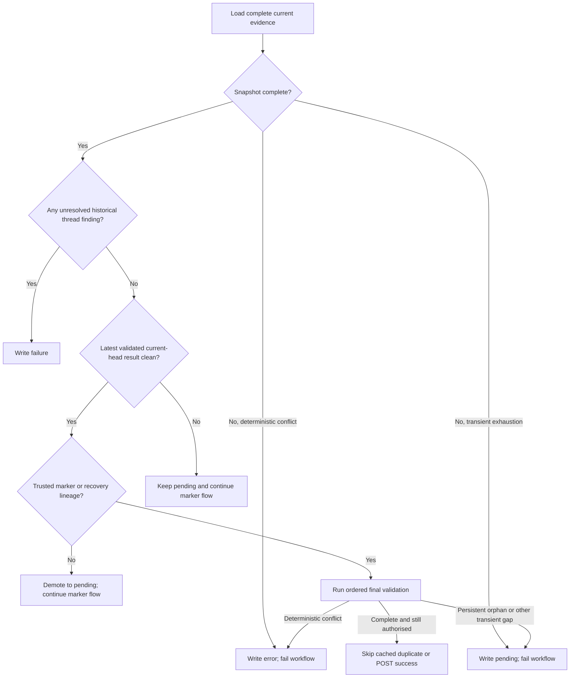
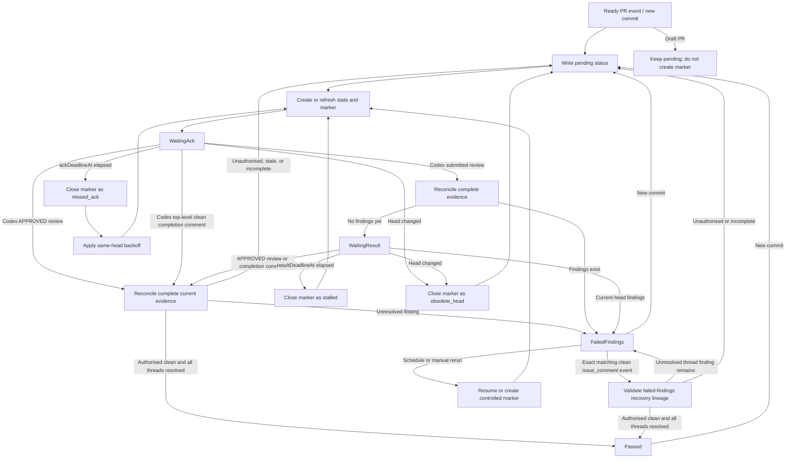

# Codex Review Gate 高级设计

语言：[British English (en-GB)](DESIGN.md) | [简体中文 (zh-CN)](DESIGN.zh-CN.md)

## 目标

`codex/review-gate` 把受控 `@codex review` 请求转换成 deterministic commit status，并可被 branch protection 要求。只有 latest accepted Codex terminal result 为 clean、明确绑定当前 PR head、由 trusted marker 或 recovery lineage 授权，且历史上所有 thread-backed Codex findings 均已 resolved 时，gate 才会通过。

## Evidence Reconciliation

每次运行都会重新构建所需 GitHub evidence，而不会把 sticky state comment 或
commit-status history 当作判定来源。

结果优先级如下：

1. 当前 evidence snapshot 经过有界重试后仍不完整时，不得通过。暂时性的 API 或分页
   重试耗尽写入 `pending`；确定性的 provider identity、schema 或 commit 冲突写入
   `error`。两种结果都会使 workflow 失败。
2. 历史上任一 thread-backed Codex finding 仍 unresolved 时，写入 `failure`。
   `isOutdated` 绝不能代替 `isResolved`。
3. 所有 thread-backed findings 均已 resolved，且当前 head 的 latest accepted terminal
   result 为 clean、并由 trusted marker 或 recovery lineage 授权时，写入 `success`。
4. 当前 head 没有 accepted clean result 时，在 marker workflow 继续运行期间保持
   `pending`。

更早的 API 读取不完整、分页失败、无法识别的身份、commit 解析失败、`pending` status
或 `error` status 都只属于审计历史，不会覆盖更新且完整的 current-head clean result。
反过来，如果比 accepted clean result 更晚的 terminal-looking provider artifact 无法
通过身份、schema 或 commit binding 校验，即使存在较早的 clean result，当前运行仍
无法得出结论。

Issue-comment terminal heading detection 会先移除可选 Markdown heading marker 后的完整
leading emoji grapheme，再识别 `Codex Review`。覆盖 modifier、regional-indicator flag、
tag flag、keycap、variation selector 和 ZWJ sequence。Parser 使用固定的 code-unit 与
grapheme budgets；emoji-shaped heading 耗尽任一预算时，会被视为 terminal-looking
malformed evidence，而不是被忽略。`Codex Review` 前出现未知的单一 decorator token
时，同样视为 terminal-looking malformed evidence；不会因此放宽 accepted clean 或
finding grammar。只有完整 normalized body 严格符合受支持的单行 progress grammar
时，才会忽略为 progress。

没有 thread 的 top-level issue-comment findings 不具备 GitHub resolution flag。它们会
保持 active，直到同一或更新 head 上更晚的 accepted clean result supersede 它们。

如果 clean result 绑定的 commit 被严格证明是当前 head 的 ancestor，它属于 stale audit
evidence，而不是 malformed evidence。当前 head 会保持 `pending`，并把该结果纳入新建
marker 的 baseline。绑定到无关、diverged 或无法验证 commit 的 clean 仍属于确定性
`error`。延迟到达的 stale issue-comment clean 也不能唤醒现有 current-head marker：
completion transition 必须精确匹配当前选中的 current-head clean provider artifact。

写入 `success` 前，action 严格按以下顺序执行：

1. Best-effort 读取并缓存同一 context 的 newest live gate status，同时保留其 producer
   identity。
2. 重新读取 PR lifecycle 和精确 head。
3. 加载 final fully paginated evidence snapshot。如果 GraphQL thread comments 与 REST
   review comments 暴露可能的 cross-channel orphan（包括 inline comment 已可见但其
   parent review 尚不可见），则执行一次有界的 whole-snapshot reload；reload 后 orphan
   仍存在时，当前运行 evidence incomplete，因此降为 `pending`。
4. 重新验证 findings、terminal-result identity 与 commit binding，以及 marker 或
   recovery authorisation。
5. 只基于缓存的 status 做 write deduplication，中间不再进行 network read。只有同一
   context 的 newest status 已是 `success`，且 producer exact 为
   `github-actions[bot]` / `Bot` 时才跳过。External 或缺失 producer 不能让 action
   回退采用更旧的 trusted status；其他情况都立即发出一次不重试的 `success` POST。

如果最初的 status read 失败，action 仍会在 final snapshot 后发布重新计算的 status。
如果一个看似 accepted 的 clean result 缺少 active-marker、精确 passed-marker
reassertion 或 failed-findings recovery lineage，则主动降为 `pending`；不能仅因它
clean 且绑定 current head 就接受。

每次 GitHub 请求 attempt 都有默认 60 秒、覆盖 fetch 和 response body 读取的 deadline。最终
`success` POST 不会盲目重试。如果该 POST 失败或超时，而 GitHub 可能已经将其落盘，
workflow 会尝试写入补偿性的 `error` status，并以非零状态退出。如果补偿写入也失败，
本次 run 仍会失败，但远端 latest status 可能暂时保留为有歧义的 `success`；这是明确的
availability limitation，必须由后续一次完整 gate run 修复后才能依赖该 status。

```mermaid
sequenceDiagram
  participant Gate
  participant GitHub
  Gate->>GitHub: GET newest same-context gate status (cache result + producer)
  Gate->>GitHub: GET PR lifecycle and exact head
  Gate->>GitHub: GET final fully paginated evidence snapshot
  opt Possible cross-channel orphan
    Gate->>GitHub: Bounded whole-snapshot reload
  end
  Note over Gate: Validate completeness, findings, result, and lineage
  Note over Gate: Deduplicate from cached status; no network read
  alt Cached newest status is expected-producer success
    Note over Gate: Skip duplicate write
  else Read failed, absent, external, missing producer, or not success
    Gate->>GitHub: POST success immediately (no blind retry)
  end
```

Sticky state comment 和 status history 不是 review evidence，但 trusted marker comment
及 state 中记录的 immutable lineage 会授权哪些 provider result 可以满足 gate。通常
clean result 必须晚于有效的 active current-head marker 及其 baseline。只有两条狭窄的
no-active-marker 路径：以精确 marker、baseline 和 observed-result lineage 重新声明
已经 `passed` 的结果；以及下文所述的 legacy same-head `failed_findings` recovery。

每次 GitHub request attempt 的默认 deadline 是 60 秒，覆盖 fetch 和 response-body
读取。对于原本允许 retry 的 response，REST 和 GraphQL 都会遵守不超过 10 秒的合法
`Retry-After`。更长的合法 delay 会立即停止：evidence read 记为 transient
`pending`，write 则失败。缺失或 malformed 的 `Retry-After` 对 retryable status 使用
正常的有界 exponential fallback；显式 403 rate limit 仍要求可用且有界的 server
delay。该 header 不会让原本不可 retry 的 method 或 status 获得 retry 资格。

## 生成式 AI 提示

受控 marker comment 会刻意保持为最小的 `@codex review` command 加 hidden gate metadata，以便 Codex GitHub integration 可靠解析。Workflow 发布受控 marker 时，会改在 GitHub Actions step summary 中写出可见提示：workflow 正在请求 Codex 生成式 AI review，Codex 可能在 PR 中发布 AI 生成的 comments 或 reviews，维护者在把这些输出用于安全性、正确性或 merge 决策前，应先进行人工核验。

Gate 是 event-driven 的。Workflow runs 会创建 markers、triage Codex signals、恢复已存储状态，或处理 retry deadlines。它们不需要在 Codex review PR 时一直占用 runner。

## Workflow 形状

推荐 workflow 监听：

- `pull_request_target` 的 `opened`、`reopened`、`ready_for_review` 和 `synchronize`
- `issue_comment` 的 `created`
- `pull_request_review` 的 `submitted`
- `schedule` 用于自动 retry scans
- `workflow_dispatch` 用于手动恢复

`pull_request_review_comment` 是可选项。它属于 `full` event mode，适合希望最快 triage inline findings，并接受一个有大量 inline comments 的 PR 可能触发更多 workflow runs 的仓库。

Workflow 必须运行可信 default branch 上的 action code。它不能在 `pull_request_target` events 中 checkout 或执行 PR 提供的代码。

Workflow 应使用一个 repository-wide concurrency group，并设置 `cancel-in-progress: false`。Scheduled scans 可以修改任何 open PR，所以它们不能和 PR-specific Codex signal runs 并发运行。

## 配置控制项

Repository 和 organization variables 是需要在 runner 启动前影响 workflow routing 的选项的首选控制面。Runtime environment variables 仍作为兼容输入接受，但只能在 runner 已经启动后生效。

### `CODEX_REVIEW_GATE_AUTO_RETRY`

把这个 repository 或 organization variable 设为 `false`，即可禁用 scheduled retry work：

```yaml
jobs:
  codex-review-gate:
    if: ${{ github.event_name != 'schedule' || vars.CODEX_REVIEW_GATE_AUTO_RETRY != 'false' }}
```

如果目标是避免为 scheduled retries 分配 runner，这必须是 `vars` 值。普通 workflow 或 job `env` 可以被 action 在 job 启动后读取，但不能阻止 scheduled job 被发送到 runner。

### `CODEX_REVIEW_GATE_EVENT_MODE`

`CODEX_REVIEW_GATE_EVENT_MODE` 可以作为 repository variable、organization variable 或 workflow/job environment variable 提供。如果两者都提供，workflow 应把最明确的 runtime value 传给 action。

支持的模式：

- `standard`: 默认值。处理 Codex top-level comments 和 submitted pull request reviews。
- `comment-only`: 只把 Codex top-level comments 当作 completion signals。Codex findings 仍会通过让 status 保持 pending 来阻塞 branch protection，直到 scheduled 或 manual scan 评估它们。
- `full`: 处理 Codex top-level comments、submitted pull request reviews 和 individual pull request review comments。

这些值是精确的小写字符串，这样 workflow-level routing 和 action runtime validation 能保持一致。

### `CODEX_REVIEW_GATE_BOT_LOGINS`

当 Codex bot identity 和默认值不同时，可以提供 `CODEX_REVIEW_GATE_BOT_LOGINS` repository 或 organization variable。示例 workflow 在 job-level event filters 中使用这个 `vars` 值，让自定义 bot comments 和 reviews 可以在 runner 分配前唤醒 gate。Action 也通过 `codex-bot-logins` input 接受同一个 comma-separated value。

### `CODEX_REVIEW_GATE_COMPLETION_SIGNAL_BUFFER_SECONDS`

`CODEX_REVIEW_GATE_COMPLETION_SIGNAL_BUFFER_SECONDS` 和
`completion-signal-buffer-seconds` action input 是 deprecated compatibility
controls，但在 v1 仍然生效：top-level clean issue comment 要满足 active marker，
必须同时晚于 marker baseline，以及 marker creation time 加上该 buffer。除此之外仍
必须满足 exact commit binding。Pull-request-review result 使用 submitted time，不使用
该 buffer。

`+1` reactions 在这个设计中是 diagnostic signals。它们在有用时会被记录，但不是主要 pass signal，因为 reactions 没有可靠的 workflow wake event。

`eyes` reactions 是 liveness signals。Gate 会检查 PR-body reactions 和 active marker comment 上的 reactions。它们会把 `WaitingAck` 推进到 `WaitingResult`，但不会让 gate 通过。

### `CODEX_REVIEW_GATE_FAILED_FINDINGS_RECOVERY`

`CODEX_REVIEW_GATE_FAILED_FINDINGS_RECOVERY` 可以作为 repository 或 organization
variable 提供，并通过 `failed-findings-recovery` 传给 action。Runtime
`FAILED_FINDINGS_RECOVERY` environment variable 也被支持。如果两者都存在，action
input 优先生效。留空或未设置时默认启用；把任一值设为 `false` 可关闭 legacy recovery
branch。

这个 switch 控制从 same-head `failed_findings` history entry 进入的狭窄
no-active-marker recovery。该路径要求当前运行由精确匹配 selected strict
current-head clean result 的 `issue_comment` event 触发，而且 clean result 必须晚于
failed marker 的 close time。设为 `false` 会关闭这条路径，但不影响 active-marker
result 或对已经 passed marker 的 exact reassertion。

### `CODEX_REVIEW_GATE_FAILED_FINDINGS_RECOVERY_MODE`

`CODEX_REVIEW_GATE_FAILED_FINDINGS_RECOVERY_MODE`、
`failed-findings-recovery-mode` 和 `FAILED_FINDINGS_RECOVERY_MODE` 是 deprecated
compatibility controls，但在 v1 仍然生效。`head` 是默认值；所有 findings resolved
后，可以复用同一个 qualifying clean comment。`fresh` 会记录 findings 仍 unresolved
时被拒绝的 qualifying recovery comment；该 comment 以及 created time 不晚于 rejection
cutoff 的其他 clean comments 都不能恢复 gate，之后必须出现更新的 qualifying clean
comment。

## GHA 成本模型 (cost model)

Happy path 通常使用两个短 job：

1. 一个 PR event 创建或刷新 state，写入 `pending`，并为当前 head 发布受控 `@codex review` marker。
2. 一个 Codex top-level completion comment 或 `APPROVED` review 唤醒 triage。Gate 会
   重新加载完整 evidence、确认 head 未变化、要求历史上所有 thread-backed findings 均已
   resolved，并写入计算出的 status。

Finding paths 取决于 event mode。在 `standard` mode 中，Codex submitted review 可以唤醒 triage 并写入 `failure`。在 `comment-only` mode 中，status 可能保持 `pending`，直到 scheduled 或 manual scan 观察到 findings。

Resolved-findings recovery path 不新增 scheduled job，也不引入 polling loop。
`failed_findings` 之后，维护者 resolve 所有 Codex review threads。狭窄的 no-marker
recovery 只会从与 selected same-head clean result 精确匹配的 top-level
`issue_comment` event 运行：`head` mode 可以 rerun 同一个 qualifying comment；
`fresh` mode 在一次 rejected recovery 后要求更新的 clean comment。Schedule 和
`workflow_dispatch` 都不能直接使用这条 no-marker exception；targeted
`workflow_dispatch` 可以改为创建新的 controlled marker，scheduled runs 只推进符合
retry 条件的 marker state。后续运行 evidence 完整时，历史 incomplete run 仍只作审计
记录。

默认 schedule 示例：

```yaml
on:
  schedule:
    - cron: "0 */2 * * *"
```

每个 scheduled run 在一个 job 中扫描 open PRs。它应跳过 draft、缺少 gate state，或
retry 尚未到期的 PR。已存储的 success 或 failure 并不能单独证明当前 readiness；
选中一个 PR 做 reconciliation 时，action 会重新构建其当前 evidence。Open PR 数量会
影响 API calls 和 wall-clock time，但不应为每个 PR 创建一个 job。

近似 scheduled runner minutes：

```text
monthly_minutes ~= ceil(avg_schedule_run_seconds / 60) * runs_per_month
runs_per_month ~= 30 * 24 * 60 / cron_interval_minutes
```

对 cost-sensitive private repositories，可以使用以下一个或多个选项：

- self-hosted runner
- 降低 schedule 频率
- `CODEX_REVIEW_GATE_AUTO_RETRY=false`
- `CODEX_REVIEW_GATE_EVENT_MODE=comment-only`

## 状态模型

Gate 用一个可信 sticky PR state comment 存储 hidden JSON metadata。这个 state 在 event
runs 之间协调 markers、retry deadlines、审计历史和幂等；它不是 authoritative review
evidence，也不能单独保留或恢复 successful gate result。

State 记录：

- 当前 tracked head SHA
- 最近写入的 status state、head 和 run URL，用于审计和幂等
- active marker ID、URL、head SHA、创建时间和 attempt number
- Codex comments、reviews 和 diagnostic reactions 的 marker baseline identities
- marker deadlines: `ackDeadlineAt`、`resultDeadlineAt`、`nextRetryAt`、`headStartedAt` 和 `maxWaitDeadlineAt`
- marker state: `waiting_ack`、`waiting_result`、`passed`、`failed_findings`、`missed_ack`、`stalled`、`timed_out`、`obsolete_head` 或 `state_lost`
- 用于 retry backoff 和 recovery 的 bounded marker history
- finding audit summary：精确 count、最多四个 sampled IDs，以及与顺序无关的 SHA-256
  digest；不会持久化完整 ID 列表
- 为 v1 兼容而保留的 legacy failed-findings recovery fields

State comment serialization 上限为 60 KiB，低于 GitHub issue-comment limit。
Normalization 会在写入前把 legacy `currentHeadFindingIds` arrays 转换成 bounded audit
summary，同时保留 marker lineage 及其他 authorisation-critical fields。因此，即使
findings 数量很大，也能持久记录 `failure`，而不会因 state 体积触发错误。

State comments 和 marker comments 只信任配置的 trusted authors。默认 trusted author 是 `github-actions[bot]`，匹配 repository workflow 的 `GITHUB_TOKEN` 路径。

把 active marker 关闭为 `failed_findings`，以及记录被拒绝的 `fresh` recovery result，
都属于 authorisation-critical transitions。Gate 会先持久化这些转换，再写 finding
status。更新 sticky state comment 失败时，会创建 replacement state comment；两次 state
写入都失败时，会尝试修改 trusted marker baseline，留下 durable lineage fence，并以
非零状态退出。Marker fence 不具备 pass authority；下一次完整运行必须先记录
`state_lost` 并创建 fresh marker，之后才可能通过。如果 replacement state 和 marker
更新都失败，non-success commit status 只记录本次 run 的失败；后续判定绝不会把 status
history 当作 review authority。在这种 issue-comment 写入全部失败的 outage 中，系统
无法保证存在 machine-readable 的跨运行撤销。恢复写权限后，operator 必须显式修复
state 或创建 fresh marker，之后才能信任旧 clean result。

Legacy state migration 不会凭空创建 pass authority。只有
`lastStatus=failure`、同一 head 的 trusted live marker、同一 head 的 failure evidence
三者同时存在时，才把 legacy entry 迁移为可验证的 `failed_findings` lineage。对于其他
方面有效的 marker，如果缺少 event-driven deadline fields，则根据其已记录时间和当前
timeout controls 补齐。其他 ambiguous 或 incomplete legacy state 保持 `pending`，并
要求 fresh marker。对于早于 `observedProviderResult` 的 v1.2 `passed` record，只有
legacy issue-comment 或 approved-review identity 与当前选中的 strict clean artifact
精确匹配、trusted live marker 仍匹配，且原 marker baseline/time window 也独立接受该
artifact 时，才会升级；gate 必须先把 canonical live artifact 持久化为
`observedProviderResult`，之后才能重新声明 success。任一证明缺失都会要求 fresh
marker；migration 不会只凭 sticky state 合成 passed marker 或 clean result。

## 状态机

Evidence reconciliation 的判定先于 marker orchestration：



下面的状态机负责协调 request markers 和 retry deadlines。任何到 `Passed` 的 transition
仍必须通过上面的完整 reconciliation；stored state 本身绝不能提供 pass decision。



```text
NoState / Passed / FailedFindings
  on ready PR event or new commit:
    write pending
    create or refresh sticky state
    close obsolete active marker if present
    create @codex review marker for current head
    create the fresh-head marker even when an older unresolved finding already blocks pass
    set ackDeadlineAt, resultDeadlineAt, nextRetryAt, headStartedAt
    -> WaitingAck

WaitingAck
  on Codex APPROVED review after marker for the same head:
    reconcile current head, latest terminal result, and all historical thread findings
    -> Passed, FailedFindings, or Pending

  on Codex top-level completion comment after marker:
    reconcile current head, latest terminal result, and all historical thread findings
    -> Passed, FailedFindings, or Pending

  on Codex submitted review after marker for the same head:
    reconcile the complete evidence snapshot
    -> FailedFindings if findings exist
    -> WaitingResult otherwise

  on manual, rerun, or schedule when ackDeadlineAt elapsed:
    close active marker as missed_ack
    compute exponential backoff from same-head missed_ack history
    create retry marker when nextRetryAt is due
    -> WaitingAck

WaitingResult
  on Codex APPROVED review or top-level completion comment after marker:
    reconcile current head, latest terminal result, and all historical thread findings
    -> Passed, FailedFindings, or Pending

  on an unresolved Codex finding:
    write failure
    close active marker as failed_findings
    -> FailedFindings

  on manual, rerun, or schedule when resultDeadlineAt elapsed:
    close active marker as stalled
    create retry marker
    -> WaitingAck

AnyState
  on draft PR:
    keep or write pending
    do not create a new marker

  on head change:
    close active marker as obsolete_head
    write pending for latest ready head
    create marker for latest ready head
    -> WaitingAck

FailedFindings
  on the exact issue_comment event matching the selected same-head clean result:
    rebuild the complete evidence snapshot
    require every historical thread-backed finding to be resolved
    require failed_findings history lineage for this head and a result newer than its close time
    apply the configured head or fresh recovery rule
    run the ordered final validation before writing
    -> Passed if all requirements remain satisfied
    -> FailedFindings if an unresolved thread-backed finding remains
    -> Pending or Error if authorisation or current evidence is incomplete

  on schedule, rerun, or manual dispatch:
    do not directly apply the no-active-marker recovery exception
    resume eligible retry state or create a fresh controlled marker
    -> WaitingAck or remain Pending
```

## Signal Rules

Accepted provider evidence 按 channel 校验：

- REST artifacts 必须来自 accepted login，且 `user.type == "Bot"`。使用默认 identity
  policy 时，官方 top-level issue comments 还必须满足
  `performed_via_github_app.slug == "chatgpt-codex-connector"`。
- REST provider、review 和 inline-comment database IDs 必须是 positive safe JSON
  integers。GraphQL opaque IDs 必须是非空且不含 whitespace 的 strings；
  `fullDatabaseId` 必须是 canonical positive decimal string。同一 REST/GraphQL
  namespace 中的 duplicate ID，或同一 channel 中 duplicate provider artifact
  identity，均属于 deterministic evidence error。
- Pull request review 通过完整 `commit_id` 绑定。Inline comment 通过 parent review 和
  `original_commit_id` 绑定；可变的 relocated inline `commit_id` 不是 provenance。
- Top-level clean result 必须匹配受支持的 clean format，并包含 reviewed-commit marker。
  短 marker 必须经 repository commit API 解析，并唯一对应完整 current-head SHA。
- Clean issue comment 使用封闭 grammar：exact
  `Codex Review: Didn't find any major issues.` lead 后只允许无 tagline，或以下已观察到的
  exact provider tagline：`Nice work!`、`Chef's kiss.`、
  `What shall we delve into next?`、`Already looking forward to the next diff.`、
  `Keep them coming.`、`Keep them coming!`、`:rocket:`、`:tada:`、`Swish.`、
  `Another round soon, please!`、`Breezy!`、`Can't wait for the next one!`、
  `More of your lovely PRs please.`、`Bravo.`、`Swish!`、`Keep it up!`、
  `Delightful!`、`Hooray!`、`You're on a roll.` 或 `:+1:`。未知 prose 或近似
  punctuation 仍 fail closed，finding signals 始终优先。
- Review-body 和没有 thread 的 top-level findings 通过精确
  `https://github.com/<owner>/<repository>/blob/<40-hex>/...` links 绑定。混合
  repositories、commits 或不受支持的当前格式都不会被接受。

Action 会完整分页读取 issue comments、reviews、inline comments、GraphQL review
threads 和 thread comments。Parent reviews、thread mappings、分页或 payload 冲突字段有
任一缺失时，当前运行会判为 incomplete，而不是 clean。即使返回页短于请求的 page
size，REST `rel="next"` link 仍是继续分页的 authoritative signal。REST 和 GraphQL
分页都有有限 page budget，且 GraphQL cursor 必须在每个非终态页继续前进。
Resolved 和 unresolved threads 都会校验 REST/GraphQL comment identity pair 及
parent-review commit binding；`isResolved` 只会把 finding 从 blocking count 中移除。

Thread-backed findings 属于历史 admission evidence。只有 `isResolved` 为 true 时，该
thread 才不再阻塞；`isOutdated` 本身没有 resolving effect。没有 thread 的 findings
保持 active，直到同一或更新 head 上更晚的 accepted clean result supersede 它们。

Final `success` path 使用 Evidence Reconciliation 中规定的顺序：cached status GET、PR
lifecycle/head GET、final complete snapshot（需要时包含一次有界 whole-snapshot orphan
reload）、no-network deduplication。只有 cached newest same-context status 已是
`success`，且来自 exact `github-actions[bot]` / `Bot` 时才跳过 POST；external 或缺失
producer 不能让更旧的 trusted status 成为 deduplication candidate。

未知的未来 provider format 会使当前运行 fail closed。后续运行一旦能解析完整且更新的
current-head clean result，较早的 format error 或 incomplete API attempt 不会继续
sticky。

## Fork 和 Dependabot PRs

GitHub 文档说明，fork 和 Dependabot PRs 的非 `pull_request_target` PR review events 可能收到 read-only `GITHUB_TOKEN`；Dependabot 触发的 `pull_request_target`、review 和 comment events 也可能以 read-only token 运行。示例 workflow 因此会在 runner 分配前过滤 Dependabot event wakeups；如果用户 workflow 省略该 filter，action 也会 defensively 跳过同一路径。

Fork PR review events 是 opportunistic 的：如果当前 PR head 来自 fork，action 会跳过 `pull_request_review` 和 `pull_request_review_comment` writes，并依赖 top-level `issue_comment`、schedule 或 manual recovery。Dependabot PRs 依赖 schedule 或 manual recovery 来取得所有 write-capable progress。Scheduled scans 可以初始化没有 prior gate state 的 Dependabot PR，因为 per-event wakeups 被有意忽略。

## Retry 和 Recovery

`workflow_dispatch` 可以 target 一个 PR，也可以 scan open PRs。Rerun 应像 resume operation 一样工作：从 GitHub 重新加载当前 PR state，忽略 stale event head assumptions，并只根据当前 evidence 推进 state machine。

如果 sticky state comment 丢失但存在 trusted marker comment，gate 必须安全恢复：

1. 把 recovered marker 记录为 `state_lost`。
2. Baseline 当前可见的 Codex signals。
3. 不从 recovered marker 通过。
4. 创建 fresh marker，或因 unresolved finding 失败。

如果 sticky state comment 存在，但 marker creation 在 marker comment 被持久化前失败，scheduled recovery 会把 current-head pending state 视为需要 fresh marker。Marker 被关闭为 `missed_ack` 或 `stalled` 后，如果 replacement marker 发布失败，也使用同样的 retry rule。

Scheduled runs 处理 retry deadlines。它们应扫描 open PRs，只为 candidate PRs 加载 state，并推进 `nextRetryAt`、`ackDeadlineAt` 或 `resultDeadlineAt` 已经过期的 markers。

如果当前 reconciliation 对暂时性 API 或分页失败耗尽有界重试，gate 会向该 PR head
写入 `pending`，并使 workflow 失败。确定性的 provider identity、schema 或 commit
冲突会写入 `error` 并使 workflow 失败。这些 states 只描述当前运行；它们不会阻止后续
完整 reconciliation 写入 `success`。

同一个 head 上连续的 `missed_ack` outcomes 使用 exponential backoff。Head change 或任何非 `missed_ack` outcome 都会为新 marker 重置 ack backoff history。

`failed_findings` 之后，维护者 resolve 所有 Codex review threads。Legacy recovery
启用时，与 selected same-head clean result 精确匹配的 `issue_comment` event 可以在
没有 active marker 的情况下恢复，但 clean result 必须晚于 failed marker close time。
`head` 可以在 resolve 后复用该 qualifying clean；`fresh` 要求 clean 晚于所有已记录的
rejected recovery cutoff。把 recovery 设为 `false` 会关闭这条 no-marker path。
Scheduled 和 manual runs 都不会直接使用该 exception；targeted manual run 可以改为
创建新的 controlled marker，而 scheduled runs 只处理符合条件的 retry state。较早的
incomplete run 只作审计记录，但当前 snapshot 不完整时仍不能成功。

## Branch Protection

Repository rulesets 应要求：

- `codex/review-gate` status check
- GitHub 原生 conversation-resolution protection，如果仓库希望 unresolved inline conversations 阻塞 merge

Status check 同时要求干净的 current-head Codex terminal result，以及所有历史
thread-backed Codex findings 已 resolved。Native conversation resolution 仍可作为独立
UI 和 branch-protection signal。
