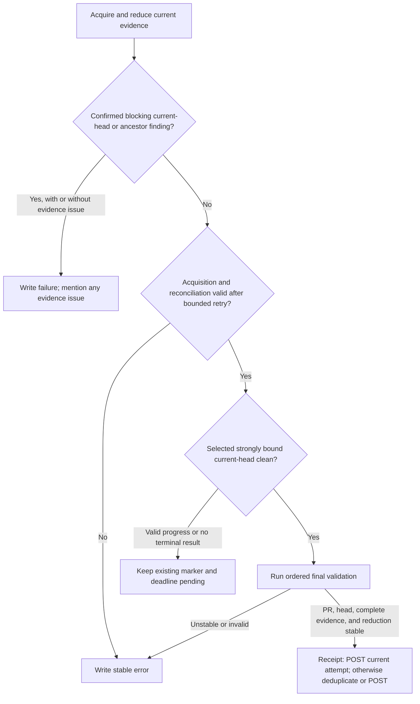
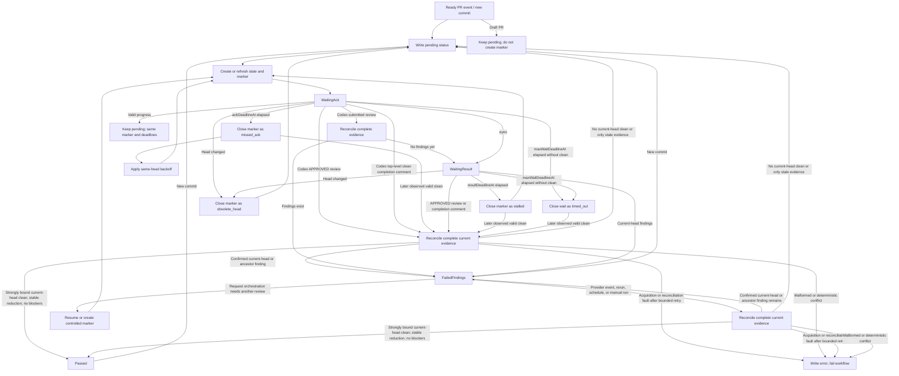

# Codex Review Gate 高级设计

语言：[British English (en-GB)](DESIGN.md) | [简体中文 (zh-CN)](DESIGN.zh-CN.md)

## 目标

`codex/review-gate` 把 Codex review evidence 转换成可被 branch protection 要求的
deterministic commit status。只有 complete 且 stable 的 evidence reduction 选出符合
封闭 clean grammar、强绑定当前 PR head 的 official trusted clean artifact，且不再有
blocking current-head 或 ancestor Codex finding 时，gate 才会通过。Pass 只表示本
required commit status 为 `success`；绝不证明 named triple review 已完成，也不证明
整体 merge-ready。受控 `@codex review` 请求用于取得 evidence，但不具备 evidence
authority。

## Evidence Reconciliation

每次运行都会重新构建所需 GitHub evidence，而不会把 sticky state comment 或
commit-status history 当作判定来源。
封闭 reducer policy 的机器可读权威表是
[`decision-table.json`](decision-table.json)，当前为 `policy_major: 1`、
`policy_version: 1.4.0`。

结果优先级如下：

1. 把每个 commit-bound finding 相对 current head 分类。Current-head 与已证明的
   ancestor findings 保留在 reduction 中。已证明的 non-ancestor finding 保留作审计、
   从 blocking set 移除，再重新归约 evidence。Unknown relationship 经过有界重试后，
   变成稳定 evidence error `ancestry-unverified`。
2. 已确认的 current-head 或 ancestor finding 仍 blocking 时，写入 `failure`。Exact
   joined thread 只有 authoritative `isResolved` 精确为 `true` 才停止阻塞；
   `isOutdated` 与 later clean result 都不能关闭它。如果同时存在其他 evidence error，
   仍保持 `failure`，并在 failure summary 中说明 evidence issue。
3. 不存在 confirmed blocking finding 时，transient acquisition 或 reconciliation
   fault 会先经过有界重试，再写入稳定 `error`。Deterministic malformed、provider
   identity、schema、commit-binding 与 ancestry error 同样写 `error`。
4. Complete reduction 保持 stable，selected official trusted clean artifact 符合封闭
   grammar、强绑定 current head，且没有 blocking finding 时，写入 `success`。
5. 存在 valid progress，或还没有 acceptable terminal artifact 时，在现有 marker 与
   deadline 下保持 `pending`。

较早运行中已持久化的 `pending`、`error` status 或已关闭 marker 等待结果只属于审计
历史。Transient API 读取不完整或分页 attempt，只有有界重试成功或后续运行重新构建出
完整 current snapshot 后才停止阻塞；有界重试耗尽会写入稳定 `error`。该完整 snapshot
中仍存在的任一 malformed 或无法识别的
provider artifact、identity failure、schema failure、commit parse/binding failure 都是
global evidence error；更新的 clean artifact 不能 supersede 它。

Evidence reconciliation 先于等待 deadline orchestration。Marker deadline 只在不存在
可接受 terminal result 时结束或重试等待，不会为 provider artifact 创建 acceptance
window。即使 valid current-head clean artifact 在 `maxWaitDeadlineAt` 后才创建，后续
完整运行仍可通过。

Issue-comment terminal heading detection 会先移除可选 Markdown heading marker 后的完整
leading emoji grapheme，再识别 `Codex Review`。覆盖 modifier、regional-indicator flag、
tag flag、keycap、variation selector 和 ZWJ sequence。Parser 使用固定的 code-unit 与
grapheme budgets；emoji-shaped heading 耗尽任一预算时，会被视为 terminal-looking
malformed evidence，而不是被忽略。`Codex Review` 前出现未知的单一 decorator token
时，同样视为 terminal-looking malformed evidence；不会因此放宽 accepted clean 或
finding grammar。只有完整 normalized body 严格符合受支持的单行 progress grammar
时，才是 valid progress。它会在现有 marker 和 deadline 下产生 pending evidence
result；不会 ACK marker、reset 或延长 deadline，也不会发布 replacement marker。
Exact grammar 之外的 terminal-looking body 属于 deterministic malformed；没有
confirmed finding 控制结果时写 `error`。

没有 thread 的 top-level issue-comment findings 不具备 GitHub resolution flag。较早的
same-head 或已证明 ancestor finding 会保持 active，除非 selected valid official
trusted clean artifact 绑定 current head，且时间严格晚于该 finding。已证明的
non-ancestor finding 只作审计，并在重新归约前移除。Issue-comment 的 `created_at` 与
`updated_at` 都必须 canonical，且 `updated_at >= created_at`；artifact revision time 使用
`updated_at`。REST issue-comment timestamps 只有一秒粒度，因此两个 issue-comment
artifacts 处于同一 revision second 时一律 ambiguous；即使 `created_at == updated_at` 也
不能证明该秒内没有 edit，numeric IDs 绝不能打破该平局。Pull-request reviews 具有同一
validated `submitted_at` 时，只能在 review channel 内用较大的 canonical ID 排序；
equal-time cross-channel evidence 仍 ambiguous。

如果 clean result 绑定的 commit 被严格证明是当前 head 的 ancestor，它属于 stale audit
evidence，而不是 malformed evidence。当前 head 会保持 `pending`；如果新建 marker，
可以把该结果纳入 baseline 以避免重复 request transition，但 baseline 不参与 provider
artifact acceptance。Clean 绑定的 commit 若已证明为 non-ancestor，包括 valid `behind`
或 `diverged` comparison，只作审计并在重新归约前移除。只有 relationship 经过有界重试
后仍 unknown，才产生 `ancestry-unverified` 的稳定 `error`。延迟到达的 stale
issue-comment clean 也不能唤醒现有 current-head marker：completion transition 必须精确
匹配当前选中的 current-head clean provider artifact。

Ancestry 使用 exact 40-hex `base...head` request endpoints 调用 REST
commit-comparison endpoint。Response 必须包含 documented `base_commit`、
`merge_base_commit`、`status`、`ahead_by`、`behind_by`、`total_commits` 和
`commits` fields。Counts 必须是 nonnegative safe integers，`total_commits` 必须等于
`ahead_by`，且 closed relationship 必须与 counts 和 merge base 一致。Unpaginated
commit list 必须含有 `min(ahead_by, 250)` 个 unique full-SHA entries，排除 base 和
merge-base commits；非空时，其 documented final entry 必须绑定 requested head SHA。`ahead` 证明
ancestor，`identical` 证明相等，合法的 `behind` 和 `diverged` 则证明不是 ancestor。
任何矛盾都作为 deterministic invalid response fail closed。只要 non-linear comparison
的两个 counts 都为正，其 status 就必须是 `diverged`，不因哪个 count 较大而改判为
`ahead` 或 `behind`。Action 不依赖 undocumented
`head_commit` field，也不会额外 GET head commit。Relationship 经有界重试后仍
unknown 时，产生 reason 为 `ancestry-unverified` 的稳定 `error`；绝不猜测。

写入 `success` 前，action 严格按以下顺序执行：

1. Best-effort 读取并缓存同一 context 的 newest live gate status，同时保留其 producer
   identity。
2. 重新读取 PR lifecycle 和精确 head。
3. 重新读取 final fully paginated evidence snapshot。如果 GraphQL thread comments 与 REST
   review comments 暴露可能的 cross-channel orphan（包括 inline comment 已可见但其
   parent review 尚不可见），则执行一次有界的 whole-snapshot reload；reload 后 orphan
   仍存在时，在有界 reconciliation 后变成 evidence error。
4. 重新验证并归约 findings、provider identity、封闭 terminal-result grammar 与 commit
   binding。重新读取的 PR lifecycle、head、complete evidence、blocking set 与 selected
   result 必须和此前 complete reduction 保持 stable；否则 action 拒绝 success。Reduction
   certificate 会绑定每个 selected 或 applicable issue-comment carrier 的 `created_at`、
   `updated_at` 与 carrier digest，因此 edit 不能在 final validation 中伪装成 unchanged
   evidence。
5. 中间不再进行 network read。Receipt mode enabled 时，即使 cached status 已匹配，也
   必须从当前 run attempt POST `success`。Receipt mode 之外，只有同一 context 的
   newest status 已是 `success`，且 producer exact 为 `github-actions[bot]` / `Bot` 时
   才跳过；其他情况发出一次不重试的 POST。

如果最初的 status read 失败，action 仍会在 final snapshot 后发布重新计算的 status。
缺少 marker、baseline、deadline、recovery 或 status-history lineage，不能把其他方面
有效的 latest current-head clean provider artifact 降为 `pending`。

每次 GitHub 请求 attempt 都有默认 60 秒、覆盖 fetch 和 response body 读取的 deadline。最终
`success` POST 不会盲目重试。如果该 POST 失败或超时，而 GitHub 可能已经将其落盘，
workflow 会尝试写入补偿性的 `error` status，并以非零状态退出。如果补偿写入也失败，
本次 run 仍会失败，但远端 latest status 可能暂时保留为有歧义的 `success`；这是明确的
availability limitation，必须由后续一次完整 gate run 修复后才能依赖该 status。

```mermaid
sequenceDiagram
  participant Gate
  participant GitHub
  Gate->>GitHub: GET newest same-context gate status (cache result + producer)
  Gate->>GitHub: GET PR lifecycle and exact head
  Gate->>GitHub: GET final fully paginated evidence snapshot
  opt Possible cross-channel orphan
    Gate->>GitHub: Bounded whole-snapshot reload
  end
  Note over Gate: Re-reduce; require stable PR, head, complete evidence, findings, grammar, and head binding
  Note over Gate: Deduplicate from cached status; no network read
  alt Receipt mode enabled
    Gate->>GitHub: POST success for this attempt (no blind retry)
  else Cached newest status is expected-producer success
    Note over Gate: Skip duplicate write outside receipt mode
  else Read failed, absent, external, missing producer, or not success
    Gate->>GitHub: POST success immediately (no blind retry)
  end
```

Sticky state comment、status history、controlled markers、marker lineage、baseline、
deadlines 和 recovery fields 都不是 review evidence，也没有 provider-artifact
authority。它们只用于 request orchestration、retry/backoff、liveness、event routing、
审计与幂等。

Provider artifact 不需要 active、closed-wait、passed-marker 或 failed-findings lineage
才有资格，也不会因 baseline、`maxWaitDeadlineAt`、marker close time、recovery switch、
`head`/`fresh` mode 或 cutoff 被拒绝。Deadline 只结束或重试当前等待；即使 artifact 在
deadline 后才创建，只要后续完整 snapshot 确认它是 latest official trusted
closed-grammar clean artifact、强绑定 current head，reduction 中没有 blocking
current-head/ancestor finding，且 final validation 保持 stable，gate 仍可通过。

Closed-wait、failed-findings 与 legacy records 只决定下一次是否或何时请求 review、
重试或记录状态；它们不能赋予或剥夺 provider evidence 的资格。

每次 GitHub request attempt 的默认 deadline 是 60 秒，覆盖 fetch 和 response-body
读取。对于原本允许 retry 的 response，REST 和 GraphQL 都会遵守不超过 10 秒的合法
`Retry-After`。更长的合法 delay 会立即停止该 attempt：evidence acquisition 在上限内
仍可 retry，耗尽后变为 `error`；write 则失败。缺失或 malformed 的 `Retry-After` 对 retryable status 使用
正常的有界 exponential fallback；显式 403 rate limit 仍要求可用且有界的 server
delay。该 header 不会让原本不可 retry 的 method 或 status 获得 retry 资格。

## 生成式 AI 提示

受控 marker comment 会刻意保持为最小的 `@codex review` command 加 hidden gate metadata，以便 Codex GitHub integration 可靠解析。Workflow 发布受控 marker 时，会改在 GitHub Actions step summary 中写出可见提示：workflow 正在请求 Codex 生成式 AI review，Codex 可能在 PR 中发布 AI 生成的 comments 或 reviews，维护者在把这些输出用于安全性、正确性或 merge 决策前，应先进行人工核验。

Gate 是 event-driven 的。Workflow runs 会创建 markers、triage Codex signals、恢复已存储状态，或处理 retry deadlines。它们不需要在 Codex review PR 时一直占用 runner。

## Workflow 形状

推荐 workflow 监听：

- `pull_request_target` 的 `opened`、`reopened`、`ready_for_review` 和 `synchronize`
- `issue_comment` 的 `created`
- `pull_request_review` 的 `submitted`
- `pull_request_review_comment` 的 `created`
- `schedule` 用于自动 retry scans
- `workflow_dispatch` 用于手动恢复

Reusable workflow 的 job filter 只在 `full` event mode 下 admit
`pull_request_review_comment`。薄 caller 始终保留该 event，使未来 mode 切换无需复制可信
filter logic。

Canonical GitHub.com caller 只包含 events、caller permission ceiling、repository-wide
concurrency 与下面这个 calling job：

```yaml
jobs:
  codex-review-gate:
    uses: JoeyTeng/codex-review-gate-action/.github/workflows/codex-review-gate.yml@v1
```

Floating `@v1` alias 是集中式 pre-execution trust delegation。Called workflow 负责可信
job filters、runner selection 与 steps。它用 full-SHA-pinned checkout，指定
`repository: ${{ job.workflow_repository }}` 与 `ref: ${{ job.workflow_sha }}`，只 materialise
resolved called release；绝不使用 bare checkout、checkout PR code，或在
`pull_request_target` event 中执行 PR 提供的代码。

Caller 只应授权 `contents: read`、`issues: write`、`pull-requests: write` 与
`statuses: write`；called workflow 不能提升 token 权限。Caller 应负责唯一的
repository-wide concurrency group，并设置 `cancel-in-progress: false`。Scheduled scans
可以修改任何 open PR，所以不能和 PR-specific Codex signal runs 并发运行。禁止在
called workflow 内重复相同 repository-wide group。

Release PR 期间该 caller 只是 staged，不会在 source root 或 template 中激活。必须先完成
immutable v1.5.0 release 与 provenance asset、验证 `v1.5` 和 `v1` aliases、通过 live
canary，再由独立 activation PR 启用。

## Invocation Provenance Boundary

Activation 后，canonical GitHub.com workflow 调用
`JoeyTeng/codex-review-gate-action/.github/workflows/codex-review-gate.yml@v1`。
Floating major alias 是刻意设置的集中式 pre-execution trust boundary，不是 post-run
immutable provenance。Post-run consumer 通过 receipt、exact-attempt API evidence，以及
trusted primary signer 签名的 immutable v1.x.y release 与 provenance asset，动态 admit
exact `job.workflow_sha`。Caller 与消费 Skill 都不固定 v1.5 SHA。

Direct composite 继续兼容，但 action ref 必须是 exact lower-case 40-SHA。GitHub
Enterprise Server 不提供 `job.workflow_*` called-workflow identity，因此该方式是其
fallback。Structural mode 在 validation 前选定；reusable mode validation 失败绝不授权
downgrade 到 direct mode。Receipt-backed positive provenance path 同样仅适用于
GitHub.com；GHES fallback 保留 direct gate operation，不提供该 admission claim。

Commit Status fields 不能证明实际运行的是哪一份 action code。Status head SHA、
`context`、`creator` 和 `target_url` 可用作 consistency checks，但持有
`statuses: write` 的 workflow 可以复现该 context 与 URL，也可能通过相同的 generic
`github-actions[bot]` identity 写入。Workflow Run API 会把 run 绑定到 workflow
metadata，但不能证明 floating `uses` reference 最终解析到的 exact action commit。

Commit Status 按 repository commit SHA 与 context 建立，不按 pull request 隔离。多个
open PR 共享同一 head SHA 时，会天然共享该 status 与 branch-protection signal。Status
本身不能证明 PR isolation：selected receipt `statuses[]` entry 的 PR number 与 skill
独立归约的 provider evidence 都必须匹配 selected current PR。

### Producer receipt v1

在 GitHub.com 上，composite Action 会生成由 `producer-receipt.schema.json` 定义、schema
ID 为 `urn:joeyteng:codex-review-gate:producer-receipt:1` 的 v1 receipt。Receipt 会捕获
`GITHUB_WORKFLOW_REF`、`GITHUB_WORKFLOW_SHA`、`job.workflow_ref`、
`job.workflow_sha`、`job.workflow_repository`、`job.workflow_file_path`、
`github.action_repository` 和 `github.action_ref`。`job.workflow_*` contexts 与本
producer-receipt contract 仅适用于 GitHub.com。

对于 canonical reusable tuple，exact repository、workflow file、`refs/tags/v1` job ref
与 lower-case 40-SHA `job.workflow_sha` 会把该 SHA 映射为 `producer.action.ref` 与
`producer.action.commit_sha`，并设置 `immutable: true`。即使 nested action context 同时
存在，该 canonical job tuple 仍优先。只有 reusable tuple 非 canonical 时，direct mode
才沿用 independently exact lower-case 40-SHA `github.action_ref` 的既有 immutable
mapping。Near-canonical reusable tuple 绝不升级 identity，也不提供 fallback。若没有该
exact direct ref，floating、near-canonical 或 local invocation 会得到
`immutable: false`，不能用作 provenance。Receipt 的 run target 必须精确为
`https://github.com/<owner>/<repository>/actions/runs/<run_id>/attempts/<attempt>`。
该 attempt path 也是 Workflow Run request endpoint。Response `url` 与 `html_url` 仍是
base-run resource URLs，不要求等于 attempt-specific target。

在 called workflow 内，`github.workflow_ref` 与 `github.workflow_sha` 保留 caller
identity。Called job implementation identity 改由 `job.workflow_repository`、
`job.workflow_file_path`、`job.workflow_ref` 与 `job.workflow_sha` 提供。Exact
self-checkout 必须使用 job repository/SHA pair；bare checkout 会 materialise caller
repository。

Receipt enabled 时，每次 `setCommitStatusIfNeeded` decision 都会强制从当前 run attempt
执行 POST，而不会复用较早的 matching status。Producer 要求每次 POST 的 REST response
提供 positive `id`、nonempty `node_id`、state/context/description/target URL 的 exact
echo，以及 creator login/type；随后连同 full head SHA 和 PR number 一起记录。一个
receipt 可以包含多个 ordered status entries，包括一次 scan 处理多个 PR 的情况。

只有 finalized 为 `completed` 或 `failed` 的 receipt 才具备 upload 资格。每个 finalized
run attempt 会通过
`actions/upload-artifact@ea165f8d65b6e75b540449e92b4886f43607fa02`（`v4.6.2`）
执行一次 action-level、`overwrite: false` 的 attempt-named artifact upload attempt，其中
恰好一个文件
`codex-review-gate-producer-receipt.json`。Composite 会暴露
`producer-receipt-artifact-id`、`producer-receipt-artifact-url` 和
`producer-receipt-artifact-digest` outputs。Producer 不声称 exactly-once artifact
creation；consumer 的 final inventory check 要求 artifact 恰好一个。

### Consumer validation

Review 或 readiness Skill 必须分开保留四个 SHA domain：caller workflow definition
（`github.workflow_sha`）、exact API run-attempt head（`head_sha`）、called
implementation（`job.workflow_sha`）与 current PR/status head。禁止要求 run-attempt
`head_sha` 或 Artifact API `workflow_run.head_sha` 等于 selected receipt status head；
禁止要求 run-attempt head 等于 `GITHUB_WORKFLOW_SHA`；也禁止要求
`GITHUB_WORKFLOW_SHA` 等于 `job.workflow_sha`。Caller workflow SHA 标识 caller
workflow revision。只有全部检查通过才可继续，否则必须 fail closed。机器可读的权威合同是
[`decision-table.json`](decision-table.json) 中的
`producer_receipt_boundary`：

1. 使用 Artifact API 查询 exact repository、run 和 attempt-specific artifact name，并
   要求 `total_count == 1`。Action outputs 可用时，把 REST artifact ID 与 output ID
   比对；按
   `<server>/<repository>/actions/runs/<run_id>/artifacts/<artifact_id>` 构造 expected
   output web URL 后再与 upload output 比对。REST artifact `.url` 是 API URL，不能直接
   与它相等比较。Upload output digest 必须是 raw 64-hex SHA-256，REST `.digest` 必须
   精确等于 `sha256:<raw-output-digest>`。下载 artifact、校验 digest，并要求其中恰好一个
   expected file。使用 dynamically admitted called commit 或 directly pinned action
   commit root 的 `producer-receipt.schema.json` 校验 JSON；同一 schema 在本 source repository 中的路径是
   `packages/action/producer-receipt.schema.json`。
2. Receipt schema 允许 finalized `execution.result` 为 `completed` 或 `failed`，但
   positive review 或 readiness decision 必须要求 `execution.result == completed`；
   `failed` receipt 仍可作为 audit evidence，但不能支持 positive decision。还要要求 run
   ID/attempt/name/target URL 完全一致，server 为 `https://github.com`，repository 为当前
   目标，所有预期 caller/workflow/job fields 一致。显式选择一个 structural mode：reusable
   要求 exact canonical job tuple，以及映射后的 action repository 与 job SHA with
   `immutable: true`；direct 要求 expected action repository 与 exact lower-case 40-SHA
   with `immutable: true`。
3. 通过 `GET /repos/{owner}/{repo}/actions/runs/{run_id}/attempts/{attempt}` 取得 run
   attempt；不要求 response `url` 或 `html_url` 为 attempt-specific。Artifact API record
   的 `workflow_run.id` 与 `workflow_run.head_sha` 必须分别等于 exact attempt response 的
   `id` 与 `head_sha`。API schema 中的 `referenced_workflows` optional 且 nullable；但在
   reusable mode 的 positive admission 中，必须要求它存在，并恰好含有一个 matching
   canonical repository/workflow-path 与 v1-call entry。其 required `sha` 必须等于
   `job.workflow_sha`、receipt action commit 与已 admitted release-provenance
   `action.commit_oid`；其 `ref` 必须存在且等于 `refs/tags/v1`。该 array 只是 run-level
   corroboration：GitHub 没有定义
   entry-to-job、entry-to-receipt map 或 cryptographic binding。
4. Reusable mode 只有下列证据齐备才能 admit called SHA：trusted primary signer 签名且
   直接 peel 到该 SHA 的 annotated immutable `v1.x.y` tag、REST record
   `immutable: true` 的对应 GitHub Release，以及完整 release-provenance schema-v2
   asset；repository immutable-release setting 也必须 enabled。校验 trusted signer fingerprint、
   commit/tree/critical-file bindings、receipt schema v1 与兼容的
   `policy_major == 1`。历史 authority 必须来自这些 immutable records，禁止从当前 `v1`
   target 推断。
5. 在 current-PR/status head domain 中，通过 REST 列出全部 Commit Status
   records 时，request `ref` 必须等于 exact current PR head；selected status 必须
   来自该 exact-head response。使用 case-insensitive context comparison 选择该
   logical context 的 latest record；随后要求
   selected record 使用 configured expected context 的 exact spelling（默认为
   `codex/review-gate`），creator 精确为 `github-actions[bot]` 且 type 为 `Bot`，再把其
   `id`、`node_id`、context、state 和 target URL 与 current PR 唯一 matching receipt
   `statuses[]` member 精确比对；它不一定是最后一个 member。该 member 的
   `head_sha` 必须等于 exact current PR head。Positive decision 还要求 selected REST
   record 与 receipt member 都满足 exact `status.state == success`。该 selected member 的 `creator`
   也必须独立精确为
   `github-actions[bot]` 且 type 为 `Bot`，其 `pull_request_number` 必须等于 selected
   current PR；membership 缺失或不唯一时 fail closed，且 receipt 没有 top-level creator。
6. 通过 GraphQL 把该 node 重新读取为 `StatusContext`。在 selected receipt status、
   REST record 与 GraphQL node 之间，要求 exact context、state 与 target URL 一致。
   `StatusContext.commit.oid` 必须等于 exact current PR head，因此也必须等于
   selected receipt status `head_sha`；同时保留 receipt/run/current state 中 called SHA 与
   workflow/job bindings。GraphQL creator 还必须独立精确为
   `github-actions[bot]` 且 type 为 `Bot`；仅 creator 彼此一致并不充分。
   `StatusContext` 不提供 PR isolation。四个 SHA domains 都可以合法地不同；consumer
   禁止臆造它们之间的 equality。
7. 按本设计为 selected receipt member 指定的同一个 PR，独立重新加载并归约 official
   provider evidence。Valid receipt 既不证明 clean evidence，也不证明 merge readiness。
8. Readiness 消费结果前，最后一次通过 REST 重列 exact-head statuses。Case-insensitive
   logical latest 必须仍有相同 REST ID 与 node ID，并保留 exact expected context；同时
   stable re-read PR head/lifecycle、exact run-attempt metadata 与使用 attempt-specific
   name 查询的 run-level artifact inventory，且 inventory 仍须恰好一个 artifact。独立归约的 provider snapshot
   与此前所有 bindings 都必须保持 stable；发生变化时做有界重试，随后 fail closed。

Canonical reusable caller 接受兼容的 v1.x Action-only release 时无需修改 caller 或
Skill；direct caller 必须更新 exact pin。Protocol 或 policy major 变化必须协调升级
Skill。Point-in-time verification 不保证 signer、key、tag、signature
或 release 的 historical/future revocation freshness；需要此类 guarantee 的 consumer
必须执行独立 revocation/freshness policy。

Status creation 与 artifact upload 不是 atomic，已上传 artifact 之后也可能过期或被
删除。Upload failure、Artifact API absence 或 `total_count != 1`、unfinished execution、
没有 matching status，或任一 receipt field 无效时，即使 status 已存在也必须 fail
closed。Receipt v1 只是 causal producer evidence，仍须独立重新校验 provider
evidence。Receipt 与 artifact digest 只提供 structured consistency/integrity evidence；
它们不是 cryptographic signature、OIDC attestation 或 content-addressed storage
guarantee。Exact creator checks 仍可被持有 `statuses: write` 的 workflow spoof；只有已
校验的 receipt/run chain 提供 causal consistency，它并不提供不可伪造的 identity。
这些 final re-reads 只是 point-in-time consistency checks；它们既不能消除所有 TOCTOU
windows，也不能让 per-SHA/context status 证明 PR-specific fact。

## 配置控制项

Repository 和 organization variables 是需要在 runner 启动前影响 workflow routing 的选项的首选控制面。Runtime environment variables 仍作为兼容输入接受，但只能在 runner 已经启动后生效。

### `CODEX_REVIEW_GATE_AUTO_RETRY`

把这个 repository 或 organization variable 设为 `false`，即可禁用 scheduled retry work：

```yaml
jobs:
  codex-review-gate:
    if: ${{ github.event_name != 'schedule' || vars.CODEX_REVIEW_GATE_AUTO_RETRY != 'false' }}
```

如果目标是避免为 scheduled retries 分配 runner，这必须是 `vars` 值。普通 workflow 或 job `env` 可以被 action 在 job 启动后读取，但不能阻止 scheduled job 被发送到 runner。

### `CODEX_REVIEW_GATE_EVENT_MODE`

`CODEX_REVIEW_GATE_EVENT_MODE` 可以作为 repository variable、organization variable 或 workflow/job environment variable 提供。如果两者都提供，workflow 应把最明确的 runtime value 传给 action。

支持的模式：

- `standard`: 默认值。处理 Codex top-level comments 和 submitted pull request reviews。
- `comment-only`: 只把 Codex top-level comments 当作 completion signals。Codex findings 仍会通过让 status 保持 pending 来阻塞 branch protection，直到 scheduled 或 manual scan 评估它们。
- `full`: 处理 Codex top-level comments、submitted pull request reviews 和 individual pull request review comments。

这些值是精确的小写字符串，这样 workflow-level routing 和 action runtime validation 能保持一致。

### `CODEX_REVIEW_GATE_BOT_LOGINS`

当 Codex bot identity 和默认值不同时，可以提供 `CODEX_REVIEW_GATE_BOT_LOGINS` repository 或 organization variable。示例 workflow 在 job-level event filters 中使用这个 `vars` 值，让自定义 bot comments 和 reviews 可以在 runner 分配前唤醒 gate。Action 也通过 `codex-bot-logins` input 接受同一个 comma-separated value。

### `CODEX_REVIEW_GATE_COMPLETION_SIGNAL_BUFFER_SECONDS`

`CODEX_REVIEW_GATE_COMPLETION_SIGNAL_BUFFER_SECONDS` 和
`completion-signal-buffer-seconds` action input 是 deprecated compatibility
controls。保留它们是为了让现有 workflow 继续可加载；runtime 会继续接受并校验其
取值，但它们不再改变 gate decision 或 request orchestration。

`+1` reactions 在这个设计中只用于审计。它们可以被记录，但不具备 clean、finding、
pass、failure 或 error verdict authority。

`eyes` reactions 是 liveness signals。Gate 会检查 PR-body reactions 和 active marker comment 上的 reactions。它们会把 `WaitingAck` 推进到 `WaitingResult`，但不会让 gate 通过。
它们保留现有 deadline，绝不 reset 或延长。

v1 timeout contract 保持不变：initial marker acknowledgement 300 秒、maximum
acknowledgement backoff 1,800 秒、acknowledged result 3,600 秒、overall 7,200 秒。

### `CODEX_REVIEW_GATE_FAILED_FINDINGS_RECOVERY`

`CODEX_REVIEW_GATE_FAILED_FINDINGS_RECOVERY` 可以作为 repository 或 organization
variable 提供，并通过 `failed-findings-recovery` 传给 action。Runtime
`FAILED_FINDINGS_RECOVERY` environment variable 也被支持。如果两者都存在，action
input 优先生效。这个 deprecated switch 只为 v1 interface compatibility 保留；runtime
会继续接受并校验其取值，但它不再改变 gate decision 或 request orchestration。Sticky
state 中已有的 legacy fields 仍作为 audit data 保留。

### `CODEX_REVIEW_GATE_FAILED_FINDINGS_RECOVERY_MODE`

`CODEX_REVIEW_GATE_FAILED_FINDINGS_RECOVERY_MODE`、
`failed-findings-recovery-mode` 和 `FAILED_FINDINGS_RECOVERY_MODE` 是 deprecated
controls，只为 v1 interface compatibility 保留。Runtime 会继续接受并校验 `head` 和
`fresh`，但两者都不再改变 gate decision 或 request orchestration。Legacy
rejected-attempt cutoff 仍是 audit data，不会要求 gate 使用更新的 clean artifact。

## GHA 成本模型 (cost model)

Happy path 通常使用两个短 job：

1. 一个 PR event 创建或刷新 state，写入 `pending`，并为当前 head 发布受控 `@codex review` marker。
2. 一个 Codex top-level completion comment 或 `APPROVED` review 唤醒 triage。Gate 会
   重新加载完整 evidence、重新归约，并要求 final PR/head/evidence result 保持 stable，
   再写入计算出的 status。

Finding paths 取决于 event mode。在 `standard` mode 中，Codex submitted review 可以唤醒 triage 并写入 `failure`。在 `comment-only` mode 中，status 可能保持 `pending`，直到 scheduled 或 manual scan 观察到 findings。

Resolved-findings recovery 不引入 polling loop。`failed_findings` 之后，维护者 resolve
每个 exact joined blocking Codex review thread。Provider event、schedule、rerun 或 targeted
`workflow_dispatch` 都可以触发新的完整 reconciliation；manual run 也可以恢复或创建
controlled request marker。后续运行 evidence 完整时，历史 incomplete run 和 legacy
recovery bookkeeping 只作审计记录。

默认 schedule 示例：

```yaml
on:
  schedule:
    - cron: "0 */2 * * *"
```

每个 scheduled run 在一个 job 中扫描 open PRs。它应跳过 draft、缺少 gate state，或
retry 尚未到期的 PR。已存储的 success 或 failure 并不能单独证明当前 readiness；
选中一个 PR 做 reconciliation 时，action 会重新构建其当前 evidence。Open PR 数量会
影响 API calls 和 wall-clock time，但不应为每个 PR 创建一个 job。

近似 scheduled runner minutes：

```text
monthly_minutes ~= ceil(avg_schedule_run_seconds / 60) * runs_per_month
runs_per_month ~= 30 * 24 * 60 / cron_interval_minutes
```

对 cost-sensitive private repositories，可以使用以下一个或多个选项：

- self-hosted runner
- 降低 schedule 频率
- `CODEX_REVIEW_GATE_AUTO_RETRY=false`
- `CODEX_REVIEW_GATE_EVENT_MODE=comment-only`

## 状态模型

Gate 用一个可信 sticky PR state comment 存储 hidden JSON metadata。这个 state 在 event
runs 之间协调 markers、retry deadlines、审计历史和幂等；它不是 authoritative review
evidence，也不能单独保留或恢复 successful gate result。

State 记录：

- 当前 tracked head SHA
- 最近写入的 status state、head 和 run URL，用于审计和幂等
- active marker ID、URL、head SHA、创建时间和 attempt number
- Codex comments、reviews 和 diagnostic reactions 的 marker baseline identities
- marker deadlines: `ackDeadlineAt`、`resultDeadlineAt`、`nextRetryAt`、`headStartedAt` 和 `maxWaitDeadlineAt`
- marker state: `waiting_ack`、`waiting_result`、`passed`、`failed_findings`、`missed_ack`、`stalled`、`timed_out`、`obsolete_head` 或 `state_lost`
- 用于 retry backoff 和 recovery 的 bounded marker history
- finding audit summary：精确 count、最多四个 sampled IDs，以及与顺序无关的 SHA-256
  digest；不会持久化完整 ID 列表
- 为 v1 兼容而保留的 legacy failed-findings recovery fields

State comment serialization 上限为 60 KiB，低于 GitHub issue-comment limit。
Normalization 会在写入前把 legacy `currentHeadFindingIds` arrays 转换成 bounded audit
summary，同时保留 marker lineage 及其他 orchestration-integrity fields。因此，即使
findings 数量很大，也能持久表示 evidence-derived outcome，而不会改变 provider-artifact
acceptance。

State comments 和 marker comments 只信任配置的 trusted authors。默认 trusted author 是
`github-actions[bot]`，匹配 repository workflow 的 `GITHUB_TOKEN` 路径。这种信任只
保护 orchestration records；provider identity 会单独校验。

当 findings 表明已持久化的 marker 属于旧 head 时，gate 会先尝试创建当前 head 的
review marker，使 request orchestration 继续存活。随后它写入由 evidence 决定的 failure
status，并把 `obsolete_head` / `failed_findings` history 作为 best-effort audit 记录到
sticky state。Sticky-state write 失败只会产生 warning，不会替换或覆盖已经计算出的
finding outcome。Durable replacement comments 和 orchestration fences 仅保留给必须延续到
后续 liveness run 的 request/deadline transitions；它们既不授权 provider evidence，也
不参与本次 gate decision。

Legacy state migration 不会凭空创建 review evidence。Legacy marker、deadline、passed
和 failed-findings fields 可以被 normalize 或用于恢复 request orchestration；
ambiguous state 也可以促使系统请求 fresh marker。Status decision 仍只由当前完整
evidence snapshot 决定：migration 既不会合成 clean artifact，也不能 veto valid latest
current-head clean artifact。

## 状态机

Evidence reconciliation 的判定先于 marker orchestration：



下面的状态机负责协调 request markers 和 retry deadlines。任何到 `Passed` 的 transition
仍必须通过上面的完整 reconciliation；stored state 本身绝不能提供 pass decision。



```text
NoState / Passed / FailedFindings
  on ready PR event or new commit:
    write pending
    create or refresh sticky state
    close obsolete active marker if present
    create @codex review marker for current head
    create the fresh-head marker even when an ancestor finding already blocks pass
    set ackDeadlineAt, resultDeadlineAt, nextRetryAt, headStartedAt
    -> WaitingAck

WaitingAck
  on a Codex APPROVED review event:
    reconcile current head, latest terminal result, and reduced current/ancestor findings
    -> Passed, FailedFindings, Pending, or Error

  on a Codex top-level completion comment event:
    reconcile current head, latest terminal result, and reduced current/ancestor findings
    -> Passed, FailedFindings, Pending, or Error

  on valid progress:
    keep pending under the existing marker and deadlines
    do not acknowledge, reset, extend, or repost

  on eyes:
    -> WaitingResult with the existing deadline unchanged

  on a Codex submitted review event:
    reconcile the complete evidence snapshot
    -> FailedFindings if findings exist
    -> WaitingResult otherwise

  on manual, rerun, or schedule when ackDeadlineAt elapsed:
    close active marker as missed_ack
    compute exponential backoff from same-head missed_ack history
    create retry marker when nextRetryAt is due
    -> WaitingAck

WaitingResult
  on a Codex APPROVED review or top-level completion comment event:
    reconcile current head, latest terminal result, and reduced current/ancestor findings
    -> Passed, FailedFindings, Pending, or Error

  on a confirmed current-head or ancestor Codex finding:
    write failure
    close active marker as failed_findings
    -> FailedFindings

  on manual, rerun, or schedule when resultDeadlineAt elapsed:
    close active marker as stalled
    create retry marker
    -> WaitingAck

AnyState
  on draft PR:
    keep or write pending
    do not create a new marker

  on head change:
    close active marker as obsolete_head
    write pending for latest ready head
    create marker for latest ready head
    -> WaitingAck

FailedFindings
  on a provider event, schedule, rerun, or manual dispatch:
    rebuild the complete evidence snapshot
    classify finding ancestry; audit-ignore proved non-ancestors and re-reduce
    require authoritative isResolved=true for each exact joined blocking thread
    validate the latest official trusted provider artifact through the closed grammar
    require the selected clean result to bind the current head
    require PR, head, complete evidence, and the final reduction to remain stable
    -> Passed if all requirements remain satisfied
    -> FailedFindings if a confirmed blocking finding remains, mentioning any evidence issue
    -> Pending for valid progress or no terminal result
    -> Error for malformed evidence or acquisition/reconciliation failure after bounded retry
    resume eligible retry state or create a fresh controlled marker only when
       request orchestration still needs one
```

## Signal Rules

Accepted provider evidence 按 channel 校验：

- REST artifacts 必须来自 accepted login，且 `user.type == "Bot"`。使用默认 identity
  policy 时，官方 top-level issue comments 还必须满足
  `performed_via_github_app.slug == "chatgpt-codex-connector"`。
- REST provider、review 和 inline-comment database IDs 必须是 positive safe JSON
  integers。GraphQL opaque IDs 必须是非空且不含 whitespace 的 strings；
  `fullDatabaseId` 必须是 canonical positive decimal string。同一 REST/GraphQL
  namespace 中的 duplicate ID，或同一 channel 中 duplicate provider artifact
  identity，均属于 deterministic evidence error。
- Pull request review 通过原生完整 `commit_id` 绑定。Review body 中若出现
  reviewed-commit hash，必须与该值一致。Inline comment 通过 parent review 和
  `original_commit_id` 绑定；可变的 relocated inline `commit_id` 不是 provenance。
- Top-level clean result 必须匹配受支持的 clean format，并恰好包含一个
  reviewed-commit marker。短 marker 必须经 repository commit API 解析，并唯一对应
  完整 current-head SHA。
- Clean issue comment 使用封闭的结构 grammar：首行以 exact
  `Codex Review: Didn't find any major issues.` 开始，之后可以直接结束，也可以用
  恰好一个 ASCII space 分隔一个 nonempty、trimmed、同首行 tagline。Tagline 只是
  presentation field，不是 evidence field；它最多 160 个 UTF-16 code units，并且必须
  exact 匹配以下一种封闭 template：
  - 一个已知 benign stem 加恰好一个结尾 `.`、`!` 或 `?`。Stem 只能是
    `Nice work`、`Chef's kiss`、`What shall we delve into next`、
    `Already looking forward to the next diff`、`Keep them coming`、`Swish`、
    `Another round soon, please`、`Breezy`、`Can't wait for the next one`、
    `More of your lovely PRs please`、`Bravo`、`Keep it up`、`Delightful`、
    `Hooray` 或 `You're on a roll`；
  - exact `:rocket:`、`:tada:` 或 `:+1:`；或
  - 一到八个 exact RGI emoji graphemes；它们可以相邻，或用一个 ASCII space 分隔。
  所有未知 prose 都 fail closed，包括未知 positive prose、actionable language 和
  contradictory language。Parser 不尝试证明自然语言语义；tagline 只用于
  presentation，不能提供 clean/finding evidence。
- 首行之后必须有且仅有一个 10 或 40 hex 的 `**Reviewed commit:**` marker，并且只能
  没有 suffix，或带 exact official disclosure；任意 trailing prose 均拒绝。Finding
  signals 始终优先，tagline 不能提供 clean/finding evidence，也不能覆盖这些 signals。
- Review-body 和没有 thread 的 top-level findings 通过精确
  `https://github.com/<owner>/<repository>/blob/<40-hex>/...` links 绑定。混合
  repositories、commits 或不受支持的当前格式都不会被接受。

Action 会完整分页读取 issue comments、reviews、inline comments、GraphQL review
threads 和 thread comments。Parent reviews、thread mappings、分页或 payload 冲突字段有
任一缺失时，都不能判为 clean，并在有界 acquisition/reconciliation retry 后变成
evidence error。即使返回页短于请求的 page size，REST `rel="next"` link 仍是继续分页
的 authoritative signal。REST 和 GraphQL
分页都有有限 page budget，且 GraphQL cursor 必须在每个非终态页继续前进。
Resolved 和 unresolved threads 都会校验 REST/GraphQL comment identity pair 及
parent-review commit binding；`isResolved` 只会把 finding 从 blocking count 中移除。

只有 current-head 和已证明 ancestor findings 会进入 blocking reduction。已证明的
non-ancestor finding 保留作 audit evidence，但会在重新归约前移除；unknown
relationship 经过有界重试后，产生带 `ancestry-unverified` 的稳定 `error`。对于 exact
joined thread，只有 authoritative `isResolved === true` 才停止阻塞；`isOutdated` 和
later clean result 都没有 resolving effect。较早的 threadless same-head 或 ancestor
finding 会保持 active，除非 strictly later selected current-head clean artifact
supersede 它。Issue comment 必须同时具有 canonical `created_at` 和 `updated_at`，并以
`updated_at` 作为 revision time。两个 issue-comment artifacts 处于同一 revision second
时一律 ambiguous；`created_at == updated_at` 不能证明不存在同秒 edit，因此 ID 绝不用于
打破平局。Same-time pull-request reviews 只能在 review channel 内使用较大的 canonical
ID；cross-channel tie 仍 ambiguous。

Final `success` path 使用 Evidence Reconciliation 中规定的顺序：cached status GET、PR
lifecycle/head re-read、final complete evidence re-read（需要时包含一次有界
whole-snapshot orphan reload）和 stable re-reduction；其 certificate 包含 carrier 的两个
timestamps 与 digest。随后 receipt mode 会立即从当前 attempt POST，使 response 进入
receipt。Receipt mode 之外，只有 cached newest same-context status 已是 `success` 且来自
exact `github-actions[bot]` / `Bot` 时才跳过；external 或缺失 producer 不能让更旧的
trusted status 成为 deduplication candidate。

Complete current snapshot 中 structurally unsupported 或 malformed 的 provider
artifact，在没有 confirmed finding 控制结果时始终属于 global evidence error；later
clean 不能清除它。Transient incomplete API attempt 只有在有界
acquisition/reconciliation 成功取得不含这类 malformed artifact 的完整 snapshot 后，才
不再 sticky。

## Fork 和 Dependabot PRs

GitHub 文档说明，fork 和 Dependabot PRs 的非 `pull_request_target` PR review events 可能收到 read-only `GITHUB_TOKEN`；Dependabot 触发的 `pull_request_target`、review 和 comment events 也可能以 read-only token 运行。示例 workflow 因此会在 runner 分配前过滤 Dependabot event wakeups；如果用户 workflow 省略该 filter，action 也会 defensively 跳过同一路径。

Fork PR review events 是 opportunistic 的：如果当前 PR head 来自 fork，action 会跳过 `pull_request_review` 和 `pull_request_review_comment` writes，并依赖 top-level `issue_comment`、schedule 或 manual recovery。Dependabot PRs 依赖 schedule 或 manual recovery 来取得所有 write-capable progress。Scheduled scans 可以初始化没有 prior gate state 的 Dependabot PR，因为 per-event wakeups 被有意忽略。

## Retry 和 Recovery

`workflow_dispatch` 可以 target 一个 PR，也可以 scan open PRs。Rerun 应像 resume operation 一样工作：从 GitHub 重新加载当前 PR state，忽略 stale event head assumptions，并只根据当前 evidence 推进 state machine。

如果 sticky state comment 丢失但存在 trusted marker comment，gate 必须安全恢复：

1. 把 recovered marker 记录为 `state_lost`。
2. 为 request orchestration baseline 当前可见的 Codex signals。
3. 独立于 recovered marker 重建完整 evidence snapshot。
4. 只有当前不存在 valid current-head clean artifact 且仍需请求 review 时，才创建
   fresh marker。

如果 sticky state comment 存在，但 marker creation 在 marker comment 被持久化前失败，scheduled recovery 会把 current-head pending state 视为需要 fresh marker。Marker 被关闭为 `missed_ack` 或 `stalled` 后，如果 replacement marker 发布失败，也使用同样的 retry rule。

Scheduled runs 处理 retry deadlines。它们应扫描 open PRs，只为 candidate PRs 加载 state，并推进 `nextRetryAt`、`ackDeadlineAt` 或 `resultDeadlineAt` 已经过期的 markers。

如果当前 reconciliation 对 transient API、分页、acquisition 或 reconciliation failure
耗尽有界重试，gate 会向该 PR head 写入稳定 `error`，并使 workflow 失败。
Deterministic malformed、provider identity、schema、commit-binding 或
`ancestry-unverified` conflict 在没有 confirmed finding 控制结果时也写 `error`。
Confirmed blocking finding 与 evidence issue 共存时，gate 写 `failure`，并在 summary
中说明 evidence issue。这些 states 只描述当前运行；它们不会阻止后续 complete 且
stable 的 reconciliation 写入 `success`。

同一个 head 上连续的 `missed_ack` outcomes 使用 exponential backoff。Head change 或任何非 `missed_ack` outcome 都会为新 marker 重置 ack backoff history。

`failed_findings` 之后，维护者 resolve 所有 exact joined blocking Codex review
threads。后续任一 provider
event、scheduled run、rerun 或 targeted manual run 都可以重建完整 snapshot。当 latest
official trusted closed-grammar clean artifact 强绑定 current head，finding ancestry 已
归约、exact joined blocking threads 已 authoritative resolved，且 final
PR/head/evidence reduction 保持 stable 时，无论 active-marker state、failed-marker
close time 或任何保留的 legacy recovery input 如何，gate 都可以通过。Marker lifecycle、
deadline、baseline 和 retry fields 仍用于 request orchestration 与审计；deprecated
recovery switch、`head`/`fresh` mode 和 recorded recovery cutoff 只是 inert
compatibility data，既不影响 gate decision，也不影响 request orchestration。较早的
incomplete run 只作审计记录，但当前 snapshot 不完整时仍不能成功。

## Branch Protection

Repository rulesets 应要求：

- `codex/review-gate` status check
- GitHub 原生 conversation-resolution protection，如果仓库希望 unresolved inline conversations 阻塞 merge

Status check 只会从 complete 且 stable 的 evidence reduction 通过：selected official
trusted provider artifact 必须符合封闭 clean grammar、强绑定 current head，且不再有
blocking current-head 或 ancestor finding。Native conversation resolution 仍可作为
独立 UI 和 branch-protection signal。本 status 不证明 triple review 或整体
merge-ready。
